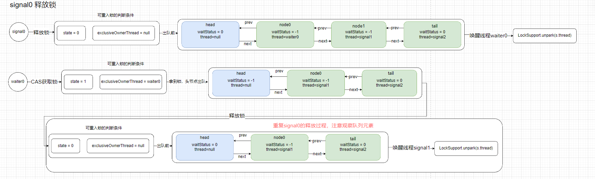

在学习AQS之前，得先知道管程是什么以及MESA模型。这对于后续学习理解AQS有着很大的作用。

### 管程

管程：指的是管理共享变量和共享变量操作的过程，使其支持并发。

互斥：同一时刻只允许一个线程访问资源。

同步：线程之间通信、协作。

#### MESA管程模型

一共由这五部分组成。

共享变量V(用于加锁)，入口等待队列，条件变量，条件等待队列。唤醒和通知方法。

> [!note] 
>
> 回忆一下
>
> ReentrantLock中可以设置Condition属性。条件可以由Condition设置。JUC中的工具类通过AQS实现的。并且AQS是根据MESA模型的理念设置的。所以理解MESA模型能让我们比较轻松的理解AQS。

管程中引入了条件变量的概念，每个条件变量都有一个等待队列，解决了线程之间同步问题。

Java中针对管程有两种实现，一种是基于Object的Monitor机制的Synchronized内置锁实现。

一种是抽象队列同步器AQS，用于JUC包下Lock锁机制实现。


了解了这个之后，我们就能实现一个锁了吗？

回想一下，多个线程抢一把锁。序号为1的线程先拿到锁，序号为2...往后的线程只能等待。也就是执行了MESA中的wait方法。然后当序号1的线程用完资源，要释放锁了。调用notify方法通知其他线程。这里就有问题了，notify不能指定哪个线程被唤醒。而notifyAll是唤醒所有的线程去抢占锁。对于某些情况下，可能使用notifyAll是合理的。但是如果说，业务需要唤醒特定的某个线程，去获取锁。那么这里就做不到了。

synchronized 是java提供的同步锁方式。但是每次在唤醒的时候，也只能随机唤醒一个正在等待的线程。或者全部唤醒来争抢锁资源。

AQS是怎么解决这个问题的呢？

使用了LockSupport的Park和UnPark方法 与 队列 结合。

队列用于维护等待线程的顺序，使得线程按照一定的等待顺序通过LockSupport的UnPark唤醒。

### AQS原理

什么是AQS？

AQS(AbstractQueuedSynchronizer)。抽象同步框架，用来实现依赖状态的同步器。Java的JUC工具类都是基于AQS实现的。

AQS特性

阻塞等待队列

共享\独占

公平\非公平

可重入

允许中断机制

#### AQS结构

参照MESA模型，共享变量对应state`volatile int state`。表示资源可用状态。

提供了三种访问方式 getState()、setState()、compareAndSetState()。

两种资源访问方式：

Exclusive 独占锁，只有一个线程能执行，例如ReentrantLock

Share 共享锁，多个线程可以同时执行，如Semaphore、CountDownLatch

AQS实现时主要实现下面几个方法

isHeldExclusively()：该线程是否正在独占资源，用到condition的时候实现。

tryAcquire(int): **独占**锁方法。尝试获取资源，成功则返回true，失败返回false。

tryRelease(int)：**独占**锁方法，尝试释放资源。成功则返回true，失败返回false。

tryAcquireShared(int): 共享锁方法。尝试获取资源。负数表示失败，0表示成功，但是没有剩余资源可用。正数表示成功，有剩余资源。

tryReleaseShared(int):共享锁方法。尝试释放资源，如果释放成功允许唤醒后续等待节点返回true，否则返回false。

#### AQS的两种队列

同步等待队列：用于维护获取锁失败入队的线程

条件等待队列：用于维护条件失败的线程，调用await()的时候会释放锁，将线程加入条件队列，调用signal的时候会把线程从队列中释放，然后加入到同步队列中，等待获得锁。

AQS定义了5个队列中节点状态：

1.值为0，初始化状态，表示当前节点在sync队列中，等待获取锁。

2.CANCELLED，值为1，表示当前的线程被取消。

3.SIGNAL，值为-1，表示当前节点的后续节点包含的线程需要运行，也就是执行unpark。

4.CONDITION, 值为-2，表示当前节点在等待conditon，也就是在条件队列中。

5.PROPAGETE，值为-3，表示当前场景下后续的acquireShared能够得以执行。

> [!note]
>
> 上面节点状态是jdk8的标准。jdk17已经没有负数的节点状态。
>
> 只剩下CANCELLED 0，WAITING 1, COND 2.

##### 同步等待队列

是一个双向链表队列，符合先进先出FIFO特性。又叫CLH队列。AQS通过该队列进行线程的等待唤醒。完成同步状态管理。

当线程获取锁失败，则将其加入到CLH队列中。等待被顺序唤醒。线程在队列中以一个node节点存在。节点包括等待状态等信息，以及前后节点“指针”。被加入到队列中的非头节点线程都会被阻塞。

通过signal或者signalAll将条件队列中的节点转移到同步队列。


##### 条件等待队列

AQS的条件等待队列是使用单向列表存储的。用nextWaiter连接。

调用await阻塞线程。


### ReentrantLock流程解析

以下以JDK8为例。

在进行ReentrantLock解析之前，先带着几个问题出发。这会帮助我们更好的理解ReentrantLock。同样的，在进行其他源码的学习的时候，也可以用这种方式。

1、公平锁和非公平锁如何实现？

实现一个方法lock。方法lock调用sync类的lock方法。实现一个抽象类Sync，继承AQS。接着再实现NonfairSync和FairSync。都继承于抽象sync类。

从这一步就能够猜到是通过不同的类进行公平锁和非公平锁的区分。

更细的，因为NonfairSync和Sync继承于Sync。只需要将公平锁和非公平锁的加锁方法lock和tryAcquire进行重写。Sync实现剩余共同的方法就可以了。值得注意的是，Sync的nonfairTryAcquire方法，这个方法用于非公平锁的抢占。当锁的类型是非公平锁，并且进行插队抢锁的时候，都会调用这个方法。

```java
/**
 * Sync object for non-fair locks
 */
static final class NonfairSync extends Sync {
    private static final long serialVersionUID = 7316153563782823691L;

    /**
     * Performs lock.  Try immediate barge, backing up to normal
     * acquire on failure.
     */
    final void lock() {
        if (compareAndSetState(0, 1))
            setExclusiveOwnerThread(Thread.currentThread());
        else
            acquire(1);
    }

    protected final boolean tryAcquire(int acquires) {
        return nonfairTryAcquire(acquires);
    }
}
/**
 * Sync object for fair locks
 */
static final class FairSync extends Sync {
    private static final long serialVersionUID = -3000897897090466540L;

    final void lock() {
        acquire(1);
    }

    /**
     * Fair version of tryAcquire.  Don't grant access unless
     * recursive call or no waiters or is first.
     */
    protected final boolean tryAcquire(int acquires) {
        final Thread current = Thread.currentThread();
        int c = getState();
        if (c == 0) {
            if (!hasQueuedPredecessors() &&
                compareAndSetState(0, acquires)) {
                setExclusiveOwnerThread(current);
                return true;
            }
        }
        else if (current == getExclusiveOwnerThread()) {
            int nextc = c + acquires;
            if (nextc < 0)
                throw new Error("Maximum lock count exceeded");
            setState(nextc);
            return true;
        }
        return false;
    }
}
```

可以看到非公平的lock会先进行一次CAS操作，尝试获取锁。成功后将锁的线程标记成当前线程。失败则进行acquire尝试获取锁。使用CAS能尽可能的提升性能。

而公平锁是直接调用acquire方法进行尝试获取锁。调用NonfairSync实现的tryAcquire方法。

> 公平锁的tryAcquire与Sync实现的非公平锁的nonfairTryAcquire不同的是，多了这一个方法hasQueuedPredecessors。用于判断当前线程是否按照CLH队列中下一个要进行唤醒的线程。

这一步就将公平锁和非公平锁的方法明确。

最后怎么构造区分公平锁或者非公平锁呢？

ReentrantLock的构造方法默认为非公平锁创建。或者直接调用有参构造方法，传入true则为公平锁。

```java
/**
 * Creates an instance of {@code ReentrantLock}.
 * This is equivalent to using {@code ReentrantLock(false)}.
 */
public ReentrantLock() {
    sync = new NonfairSync();
}

/**
 * Creates an instance of {@code ReentrantLock} with the
 * given fairness policy.
 *
 * @param fair {@code true} if this lock should use a fair ordering policy
 */
public ReentrantLock(boolean fair) {
    sync = fair ? new FairSync() : new NonfairSync();
}
```

因为sync是抽象的，所以公平和非公平的调用方式不依赖于程序员编码。而是直接交给框架。(这里回顾一下IOC)。程序员不需要每次都关注lock的实现。是一种很好的解耦方式。

2、锁的可重入如何实现？

在前面已经提到过，ReentrantLock是通过实现不同的Sync类方法来区分公平锁和非公平锁。而Sync继承了AQS。也就是说ReentrantLock的锁逻辑是通过AQS实现的。

AQS中的state是一个volatile 修饰的 整形变量。AQS可以通过使用这个state进行重入锁的判断。没重入一次，就给state + 1 ，这就解决了当前线程进行了几次重入的计数问题。当然了，可重入的操作不是AQS默认实现的，AQS只是方便开发者进行锁的构建。

接下来看看ReentrantLock是怎么做的。

公平锁和非公平锁的实现对可重入的实现是相同的。这里抽象出结构代码。

```java
xxxx (int acquires){
    // 前置代码xxxxx
    int c = getState();
    if (c == 0) {
        // 没有任何线程占用锁时候的 逻辑代码
    } else if (current == getExclusiveOwnerThread()) {
        int nextc = c + acquires;
        if (nextc < 0) 
                    throw new Error("Maximum lock count exceeded");
        setState(nextc);
        return true;
    }
    // 后置代码xxxx
}
```

先判断了当前的共享变量state是否是空闲状态，是则直接加锁。否则进入可重入逻辑判断。

可重入的判断也很简单，只需要判断当前线程是不是锁占用的线程。是则进行可重入计算。计算重入次数后更新state状态。

因此，借助AQS实现可重入锁还是比较简单的。

3、ReentrantLock的独占锁如何实现？

ReentrantLock中，直接调用了AQS的acquire方法。这个方法会直接创建关于独占锁的Node。这个Node作用于CLH队列和Condition队列，表示Node.EXCLUSIVE 独占模式。

4、并发场景下的AQS的CLH入队和出队如何实现？

 


- 线程竞争加锁入队阻塞逻辑

如上图所示，

1.线程2先尝试CAS获取锁，获取失败，进入acquire逻辑。 

2.获取state为1，表示锁已经被占用，此时判断当前线程是不是占用和锁的线程。如果是，则进入重入锁逻辑。否则，进入阻塞队列

3.创建当前线程的node节点。接着初始化队列（利用尾节点是否为空判断生成）。最后将node接上当前队列的头节点和尾节点。头节点在出现线程竞争的时候初始化。头节点表示当前获得锁的线程，但是其内容thread为空，状态被初始化为0。

4.创建队列后，还会用CAS尝试获取锁，如果获取失败，将当前节点的前一个节点的状态改为-1.然后再次尝试CAS获取锁，失败则进行阻塞。

- 释放锁的线程唤醒阻塞线程后，阻塞进程重新竞争锁的逻辑。


1.当锁释放后，被阻塞的线程将被唤醒。在执行LockSupport.unpark(s.thread)唤醒线程后。被唤醒的线程会从阻塞唤醒代码下一行继续运行。

2.此时还在循环内，直接进行一次CAS操作抢锁。

3.拿到后，将原本头节点(上一个获取到锁的线程的占用位置)断开，设置头节点为当前节点。

5、Condition条件变量如何实现？

Condition也是通过AQS实现的。sync类实现一个newCondition的方法。方法返回一个ConditionObject对象。该对象在AQS中实现。开发者要使用ReentrantLock的Condition的时候，只需要调用ReentrantLock方法的newCondition方法。然后在对应的业务逻辑中使用await类和signal类的方法。

Condition 在并发场景下的条件队列出入队逻辑

加入条件队列后的Node，满足条件后出队会加入到CLH同步等待队列中。接着根据队列情况逐个出队。

> [!note] 
>
> 在JDK8的ReentrantLock中，关于CLH同步等待队列和条件队列，条件队列出队的元素会加入到CLH队列末尾，并且在出队的时候，无论ReentrantLock是公平锁还是非公平锁，都是按照队列从队首到队尾逐个出队。 
>
> 这里描述的出队情况只是针对唤醒。因为非公平锁当有线程正在竞争的时候，可能会直接抢走锁，队列的node不能成功唤醒。

> [!warning]
>
> 以下图示例子代码代码如下
>
> ```java
> public class ConditionDemo {
>     private static ReentrantLock lock = new ReentrantLock();
>     private static Condition condition = lock.newCondition();
>     private static volatile boolean flag = false;
> 
>     public static void main(String[] args) throws InterruptedException {
>         for (int i = 0;i < 4;i ++) {
>             new Thread(new waiter(), "waiter" + i).start();
> //            Thread.sleep(2000);
>             new Thread(new signaler(),"signaler" + i).start();
>         }
>     }
> 
>     static class waiter implements Runnable {
> 
>         @Override
>         public void run() {
>             lock.lock();
>             try {
>                 while (!flag) {
>                     System.out.println(Thread.currentThread().getName() + "当前条件不满足等待");
>                     try {
>                         // TODO
>                         condition.await();
>                     } catch (InterruptedException e) {
>                         e.printStackTrace();
>                     }
>                 }
>                 System.out.println(Thread.currentThread().getName() + "接收到通知条件满足");
> 
>             } finally {
>                 lock.unlock();
>             }
>         }
>     }
> 
>     static class signaler implements Runnable {
> 
>         @Override
>         public void run() {
>             lock.lock();
>             try {
>                 flag = true;
>                 System.out.println(Thread.currentThread().getName()+"唤醒waiter");
>                 condition.signal();
>             } finally {
>                 lock.unlock();
>             }
>         }
>     }
> }
> 
> 

条件队列入队


该部分省略了获取锁的逻辑。获取锁的逻辑实际与没有Conditon条件差不多，区别是，因为每次waiter线程都会释放锁，所以在waiter线程中基本不存在锁竞争情况。

waiter这部分逻辑比较简单。

```java
        /**
         * Implements interruptible condition wait.
         * <ol>
         * <li> If current thread is interrupted, throw InterruptedException.
         * <li> Save lock state returned by {@link #getState}.
         * <li> Invoke {@link #release} with saved state as argument,
         *      throwing IllegalMonitorStateException if it fails.
         * <li> Block until signalled or interrupted.
         * <li> Reacquire by invoking specialized version of
         *      {@link #acquire} with saved state as argument.
         * <li> If interrupted while blocked in step 4, throw InterruptedException.
         * </ol>
         */
        public final void await() throws InterruptedException {
            if (Thread.interrupted())
                throw new InterruptedException();
            // 初始化队列和节点
            Node node = addConditionWaiter();
            // 释放锁
            int savedState = fullyRelease(node);
            int interruptMode = 0;
            while (!isOnSyncQueue(node)) {
                // 不存在于CLH中，线程park
                LockSupport.park(this);
                if ((interruptMode = checkInterruptWhileWaiting(node)) != 0)
                    break;
            }
            if (acquireQueued(node, savedState) && interruptMode != THROW_IE)
                interruptMode = REINTERRUPT;
            if (node.nextWaiter != null) // clean up if cancelled
                unlinkCancelledWaiters();
            if (interruptMode != 0)
                reportInterruptAfterWait(interruptMode);
        }
```

1.在获取锁成功后，当运行到await时，如果没有队列，则进行条件队列节点和队列的初始化。否则进行节点初始化并加入到队列中。

2.释放锁

3.阻塞线程

如果是signal

signal将唤醒waiter的线程。将条件队列中的元素出队到CLH中。**这里假设signal线程都没有释放锁**。

```java
        /**
         * Moves the longest-waiting thread, if one exists, from the
         * wait queue for this condition to the wait queue for the
         * owning lock.
         *
         * @throws IllegalMonitorStateException if {@link #isHeldExclusively}
         *         returns {@code false}
         */
        public final void signal() {
            if (!isHeldExclusively())
                throw new IllegalMonitorStateException();
            Node first = firstWaiter;
            if (first != null)
                doSignal(first);
        }

        /**
         * Removes and transfers nodes until hit non-cancelled one or
         * null. Split out from signal in part to encourage compilers
         * to inline the case of no waiters.
         * @param first (non-null) the first node on condition queue
         */
        private void doSignal(Node first) {
            do {
                if ( (firstWaiter = first.nextWaiter) == null)
                    lastWaiter = null;
                first.nextWaiter = null;
            } while (!transferForSignal(first) &&
                     (first = firstWaiter) != null);
        }

    /**
     * Transfers a node from a condition queue onto sync queue.
     * Returns true if successful.
     * @param node the node
     * @return true if successfully transferred (else the node was
     * cancelled before signal)
     */
    final boolean transferForSignal(Node node) {
        /*
         * If cannot change waitStatus, the node has been cancelled.
         */
        if (!compareAndSetWaitStatus(node, Node.CONDITION, 0))
            return false;

        /*
         * Splice onto queue and try to set waitStatus of predecessor to
         * indicate that thread is (probably) waiting. If cancelled or
         * attempt to set waitStatus fails, wake up to resync (in which
         * case the waitStatus can be transiently and harmlessly wrong).
         */
        // 熟悉的CLH初始化和入队
        Node p = enq(node);
        int ws = p.waitStatus;
        if (ws > 0 || !compareAndSetWaitStatus(p, ws, Node.SIGNAL))
            LockSupport.unpark(node.thread);
        return true;
    }
```

1.获取锁

2.初始化CLH队列并将条件队列中的元素入队


可以发现，如果signal没有释放锁，后续的signal都会被加入到CLH队列中。这些signal只有在后面被唤醒的时候，才会将条件队列中的Node出队，加入到CLH队列中。

这里出队后不会将Node直接加入到CLH中，而是交给GC回收。另外new 了一个Node加入到CLH队列中。

出队

接下来，当signal0释放锁

waiter0就会被唤醒，执行剩余的await逻辑 ->获取锁，CLH的头节点出队，释放锁(唤醒CLH下一个线程)。释放锁这个步骤实际上跟没有Condition条件的ReentrantLock差不多。

当signal1被唤醒后，因为他是在lock加锁阶段被阻塞的，通过CAS获取锁成功，将头节点出CLH队列。执行signal0一样的条件队列出队，CLH入队。然后释放锁。

signal2被唤醒时操作同signal1一样。

> [!note]
>
> 这里signal1、signal2和waiter0释放锁逻辑都和没有Conditon条件的ReentrantLock释放锁逻辑一样。
>
> 因此逻辑可以简化为 获取锁 -> CLH头节点出队 -> 条件队列出队(如果是signal线程) -> 释放锁。
>
> 而条件队列出队逻辑与signal0在获取锁成功后，执行的signal逻辑一样。





总结一下，ReentrantLock通过AQS实现的方式与开头提到的MESA模型逻辑一致。如果存在条件队列，不符合条件队列的入队，出队时加入到同步队列中。由同步队列进行管理和唤醒。

虽然说最后Conditon这一部分表达和描述不是很清楚，很容易转晕，建议每次看的时候配合debug一下，比较容易理解。


### 如何设计一把独占锁？

>一把锁需要什么？
>
>synchronized 使用需要指定同一个对象或者类。ReentrantLock通过共享变量state实现。
>
>因此需要一个值，一个能共享给多个线程使用的值。所以选用共享变量state。
>
>如何加锁呢？
>
>通过CAS实现
>
>加锁失败怎么办？
>
>加入到同步等待队列中。
>
>如何唤醒队列中的元素？
>
>通过LockSupport的park和unpark能够操作指定线程等待或者唤醒。
>
>如果需要给锁加上一些特定条件，怎么办？
>
>引入条件队列，不满足条件的入队，满足条件的出，加入到同步等待队列。由同步等待队列统一管理唤醒。
>
>等待唤醒机制有那些？
>
>synchronized + Object           object.wait()/object.notify()/object.notifyAll
>
>ReentrantLock + Condition    condition.await()/condition.signal()/condition.signalAll()

通过上面的问题，现在心里大概有个模糊的方向去设计一把独占锁。但是从0开始实现效果可能不是那么好，因此可以参考一下ReentrantLock的实现方式。使用AQS实现。

```java
public class MyLock extends AbstractQueuedSynchronizer {
    @Override
    protected boolean tryAcquire(int arg) {
        // 加锁 state = 0
        if (compareAndSetState(0 , arg)) {
            setExclusiveOwnerThread(Thread.currentThread());
            return true;
        } else if (Thread.currentThread().equals(getExclusiveOwnerThread())){
            int state = getState();
            state = state + arg;
            setState(state);
            return true;
        }
        return false;
    }

    @Override
    protected boolean tryRelease(int arg) {
        // 释放锁
        int state = getState() - arg;
        if (Thread.currentThread().equals(getExclusiveOwnerThread())) {
            setState(state);
        }
        boolean free = (state == 0);
        if (free) {
            setExclusiveOwnerThread(null);
        }
        return free;
    }

    public void lock() {
        acquire(1);
    }

    public void unlock() {
        release(1);
    }

    public void tryLock() {
        tryAcquire(1);
    }

    @Override
    protected boolean isHeldExclusively() {
        return getExclusiveOwnerThread() == Thread.currentThread();
    }

    // 条件变量
    public ConditionObject newCondition() {
        return new ConditionObject();
    }
}
```

上面的代码实现了独占锁、可重入锁，以及条件变量。并且使用了默认的非公平锁。后续再考虑添加公平锁和非公平锁的实现。

这里记录实现步骤：

1、基本的锁内容 

lock 和 unlock方法。参照AQS中，lock调用acquire方法，但是需要重写tryAcquire方法。

release 释放锁，同样需要重写tryRelease方法。

2、实现了基本的锁之后，在此添加可重入逻辑

上面的内容中我们学习到ReentrantLock可重入实际上是按照共享变量state进行计数的。因此我们也可以借助这个思想实现。

只需要在tryAcquire和tryRelease方法上进行修改，添加可重入逻辑。

> [!note]
>
> 可重入一共需要判断两个条件
>
> 1.是当前state是否是0，也就是是否有线程占用锁。 只有1的时候才需要执行可重入逻辑
>
> 2.判断当前线程是否是锁占用的线程。可重入锁是针对同一个线程进行的。

3、让这把锁适配条件变量，方便拓展

在ReentrantLock中，条件变量直接调用了AQS的 `new ConditionObjct()`方法来创建条件变量，剩余的条件变量的await 和 signal全部由AQS实现。

> [!warning]
>
> 注意这里要重写实现isHeldExclusively()，进行锁线程操作判断，否则会报错。

---

额外补充

> [!note]
>
> 根据 jdk17。这个流程是我一点点debug找出来的。没有加上condition相关的逻辑。这个图就不画了。简单记一下。
>
> 第一个线程(队首节点)
> 直接在tryLock阶段获取到锁。设置state为1并且标记独占锁线程为第一个线程(当前线程)
>
> 第二个线程(第二个节点)
>
> 1.tryLock失败，在acquire中尝试获取锁
>
> 2.acquire
> 第一次循环进行一次cas操作尝试获得锁，失败则新增一个空的node节点。
>
> 第二次循环进行一次cas操作尝试获得锁，失败则给新增的node节点赋值当前节点值并初始化头节点。
>
> 第三次循环进行一次cas操作尝试获得锁，失败则给新增的node节点赋值当前节点值并设置前节点和后节点。
>
> 第四次循环进行一次cas操作尝试获得锁，失败则对node节点的status给1。
>
> 第五次循环进行一次cas操作尝试获得锁，失败则给当前线程park。
>
> 第三个线程 (非队首节点和第二个节点)
>
> 1.tryLock失败，在acquire中尝试获取锁
>
> 2.acquire
>
> 第一次循环进行一次cas操作尝试获得锁，失败新增一个空的node节点。
>
> 第二次循环进行一次cas操作尝试获得锁，给新增的node节点赋值当前节点值并设置前节点和后节点。
>
> 第三次循环对node节点的status给1。 (这里确定了，当前节点获取不到锁所以没有对后续的操作进行CAS操作)
>
> 第四次循环给当前线程park。

