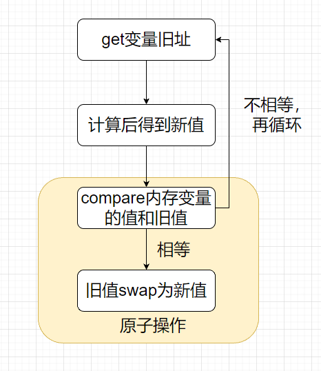
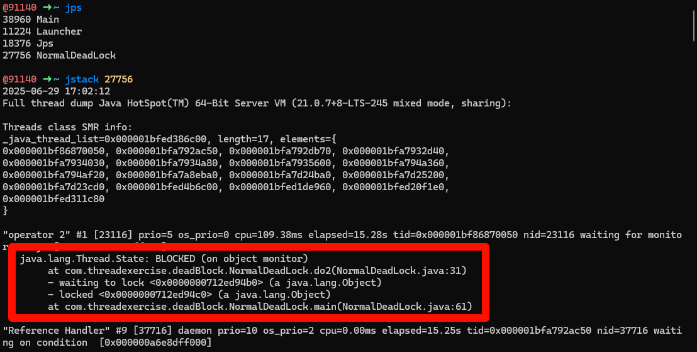
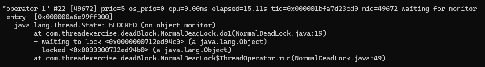
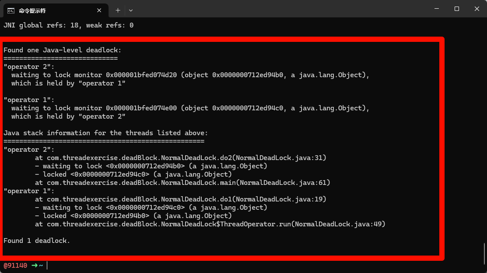

### CAS

CAS 全程 compare and swap，对比和交换。在了解CAS之前，得明白什么是原子操作。

> [!tip] 
>
> 什么是原子操作？
>
> 应该有相当一部分人说不清楚这个概念。原子性是数据库的四大特性，相信大家都不陌生。一个事务包含多个操作，要么全都做，要么全都不做。这就是原子性。原子操作也是同理的，如果说一个方法里面又有查询，插入又有修改，并且他们都被事务包裹，那么就满足了全部做或者不做。那么就称这个方法具有原子性。
>
> 简单的说：如果一个方法的所有操作要么全都做，要么全都不做，那么就实现了原子性。
>
> 原子操作是不可分割的单个操作，在CPU层面保证执行过程不被中断。是一种底层实现机制。可以结合原子性理解。
>
> 如何实现原子操作呢？
>
> 答案是加锁。锁确保了一个线程/进程只能在同一时间访问这部分资源，其他线程无法操作。要么全部完成，要么完全不执行。

synchronized关键字是基于阻塞的锁机制，但是这把锁中涉及到的CPU指令集有点多，如果只是修改一个值而不是一个对象，并且这个值可能被许多线程修改。那么这里的资源消耗是非常大的。

为了解决这种问题，Java引入了Atomic系列的原子操作类。这些操作都是基于CPU底层提供的CAS操作指令实现的。

CAS操作包含三个运算符: 一个内存地址V，一个期望值A，一个新值B。操作的时候如果这个地址V上的值等于旧值A，那么将他直接修改为新值B。否则不做任何操作。

CAS的基本思路是：如果这个值和期望值A相同，那么赋值为新值A，返回旧值B。当有大量的线程对一个内存地址进行操作时，那么自然就只能有一个线程可以完成。其他的不能完成怎么办呢？这里就有一个自旋操作。不能成功修改的进行自旋，获取旧值计算后再尝试修改。直到所有线程完成为止。



Java中的Automic就是用了循环CAS完成。

#### CAS的三大问题

- ABA问题 

CAS中是，比较地址V中的值，如果等于旧值B，那么可以替换为A。如果说出现一个线程1想把B改为C的线程。但是有另外的线程把B先改为D，又把D改为B了，这个动作很快。在B被改为D之前呢，线程 1 先比较了B，准备改为C，但是被先一步改为D，又改回B了。这时候如果线程1去替换成C，那么这个值就有可能不对了。这种使用CAS进行检查发现没有变化，但是实际变化了的情况。叫做ABA问题。

可通过版本字段控制

在改变量的同时一并改同一条记录的版本号。比如一开始是B，版本号是1，在改为C的时候版本号 + 1，就是C 和 版本号2，再改为B，版本号 + 1，就是B 版本号 3. 过程是 (B 版本号1 -> D 版本号2 -> B版本号3)。这样就可以知道，原来实际上这个值B已经变动过一次了。

- 自旋

多线程情况下，其他线程太多导致等待次数剧增。Java中Automic的CAS操作是循环CAS。如果说有大量的线程比如 10000个，要同时改一个地址V的旧值B。第一个线程修改成功了，改为了A。那么第二个改变的线程得自旋1次才能改成C，第三个改变的线程得自旋2次才能改为D。以此类推，当第10000个线程改动的时候，就得自旋9999次。这对CPU资源消耗是巨大的。

> [!note]
>
> 这里第几个线程改动不是指按顺序的改动，因为每个线程的执行时间和调度顺序可能不一样。这里只是特指，在第n个线程改动时，会经历 n - 1次自旋。

- 一个变量的原子操作

CAS一般只能修改一个变量，在上面的介绍中。了解到CAS只能对一个地址V进行比较更改。如果说多个CAS操作呢？也不能保证操作的原子性。这时候只能用锁。或者是将多个共享变量合并为一个共享变量进行操作。JDK提供了AtomicReference类实现。可以将多个变量放在一个对象中进行CAS操作。

### Automic

后续添加...

### 线程安全相关

什么是线程安全？我们所写的代码在并发情况下，总是能够表现出正确的行为。反过来，未实现线程安全的代码，表现的行为是不确定的，有可能正确也有可能错误。

如果要实现线程安全，就要保证我们的类是线程安全的。

> [!tip] 
>
> Java并发编程中定义类是线程安全的如下：
>
> 当多个线程访问某个类的时候，不关运行时环境采用何种调度方式或者线程将如何交替执行，并且在调用代码中不需要任何额外的同步或者协同，这个类都能表现出正确的行为，那么称这个类是线程安全的。

#### 如何实现线程安全呢？

##### 线程封闭

实现好的并发是一件困难的事情。我们通常都很害怕麻烦，通常都会想躲避掉这些麻烦(并发)，如何躲避呢？线程封闭是一种简单的方式，如果有一个对象只能被一个线程访问，即使他是线程不安全的，那么也没关系，因为别的线程不能访问，只有这个线程才能访问。这样所有改变的操作只能他来做，那么就不会出现任何问题了。

###### 栈封闭

栈封闭是编程中遇到最多的线程封闭，什么是栈封闭呢？

我们知道在方法在运行时，局部变量会被压入栈中。而JVM在编译运行时每个线程有自己的线程栈。线程栈中同样保存着局部变量。当多个线程访问同一个方法时，此方法的局部变量都会被拷贝一份到线程栈中。所以局部变量不被多个线程所共享，因此就不会出现线程安全问题。所以能用局部变量就不要用全局变量，全局变量容易出现并发问题。

###### ThreadLocal

每个线程有自己的ThreadLocal存放着变量副本，各个线程有独立的变量副本，在各自修改的时候改的也是自己的变量副本。因此也不会出现线程安全问题。

##### 无状态的类

什么是无状态的类？就是没有任何成员变量的类。这种类一定是线程安全的。只有方法中的局部变量，而上面也说了局部变量属于栈封闭。因此是线程安全的。如果说类的方法参数中使用了对象，也是线程安全的吗？

这个类依然是线程安全的。即使不安全的是这个对象。因为这个类没有直接持有这个不安全的对象实例，类自身不会有任何问题，有问题的是这个对象，不能说这个类不是线程安全的。

##### 类不可变

final关键字让状态不可变。对于一个类，所有的成员变量应该是私有的，并且允许的话，应该都加上final关键字，但是加上final意味着这个成员变量如果是一个对象，这个对象所对应的类也是不可变的。才能保证这个类是不可变的。

> [!warning]
>
> 一旦类的成员变量中有对象，final关键字保证不可变并不能保证类的安全性，因为在多线程下，虽然对象引用不可变，但是在堆上的实例还是有可能被多个线程同时修改的，没有正确处理的情况下，对象实例在堆中的数据是不可预知的。

##### 加锁和CAS

最容易想到的方式就是加锁了。synchronized关键字或者各种原子变量的CAS机制、显示锁等。

#### 死锁

死锁是指两个或者两个以上线程争夺资源导致彼此通信停滞阻塞的现象。如果没有外力干扰，他们就无法推进，这时称系统处于死锁状态或者产生了死锁。

死锁是避让发生在多操作者(m≥2)争夺多个资源(n≥2)。且(n≤m)。单资源不会发生死锁。多资源单操作者也不会发生死锁。另外资源的顺序也很重要。如果说争夺资源顺序是一样的也不会发生死锁。

> [!note]
>
> 在操作系统中的定义
>
> 死锁发生必须具备的四个条件
>
> 1) 互斥条件：指进程对所分配的资源进行排他性使用。即在一段时间内某资源只由一个进程占用。如果此时还有其他进程请求资源，则请求者只能等待，直至占有资源的进程释放。
> 2) 请求和保持条件: 指进程已经保持了至少一个资源，但又提出了新的资源请求，而该资源已被其他进程占用，此时请求进程阻塞，但又对自己已经获得的其他资源保持不放。
> 3) 不剥夺条件：指进程已获得的资源，在未使用完之前不能被剥夺，只能在用完后由自己释放。
> 4) 环路等待条件：指在发生死锁时，必然存在一个进程--资源的循环链，即进程集合{P0,P1,P2...Pn}中的P0正在等待一个P1占用的资源，P1正在等待一个P2占用的资源，.....，Pn正则等待已被P0占用的资源。

只要破坏四个必要条件之一就能打破死锁。这也是预防死锁发生需要打破的四个条件。

> [!tip]
>
> - 打破互斥条件: 改造独占性资源为虚拟资源，大部分资源已经无法改造。
> - 打破申请和占有条件: 在使用资源时，一次性申请所有资源，如果无法全部申请，那么放弃，等待至能够申请全部资源运行。
> - 打破不可抢占条件：当进程占有一独占性资源后又申请一独占性资源而无法满足，则释放原来占有的资源。
> - 打破循环等待条件：采用资源有序分配策略，所有进程只能按顺序申请资源。

##### 现象、危害和解决

数据库中多个事务要同时操作同一个表的情况。所以数据库在设计之初就考虑到了检查死锁和从死锁中恢复的机制。Java中怎么检测呢？

###### 现象

需要记住

- 简单顺序死锁

```java
public class NormalDeadLock {

    // 第一个锁
    private static Object block1 = new Object();
    // 第二个锁
    private static Object block2 = new Object();

    // 第一个拿锁的方法
    private static void do1() throws InterruptedException {
        String threadName = Thread.currentThread().getName();
        synchronized (block1) {
            System.out.println(threadName + " get block1");
            Thread.sleep(100);
            synchronized (block2) {
                System.out.println(threadName + " get block2");
            }
        }
    }

    // 第二个拿锁方法
    private static void do2() throws InterruptedException {
        String threadName = Thread.currentThread().getName();
        synchronized (block2) {
            System.out.println(threadName + " get block2");
            Thread.sleep(100);
            synchronized (block1) {
                System.out.println(threadName + " get block1");
            }
        }
    }

    // 子线程, 代表第一个拿锁的操作者
    private static class ThreadOperator extends Thread {

        private String name;

        public ThreadOperator(String name) {
            this.name = name;
        }

        @Override
        public void run() {
            Thread.currentThread().setName(name);
            try {
                do1();
            } catch (Exception e) {
                e.printStackTrace();
            }
        }
    }

    public static void main(String[] args) throws InterruptedException {
        // 主线程，代表第二个操作者
        Thread.currentThread().setName("operator 2");
        ThreadOperator threadOperator = new ThreadOperator("operator 1");
        threadOperator.start();
        do2();
    }
}

```

这里do1和do2中sleep(100)防止某个线程一次性争抢到2把锁跳过死锁条件。

- 动态顺序死锁

实际上也就是跟获取锁的顺序有关。但是有时候开发者可能无法察觉。

```java
public class DyDeadLock {

    // 第一个锁
    private static Object lock1 = new Object();
    // 第二个锁
    private static Object lock2 = new Object();

    // 公共业务方法
    private static void bussinessDo(Object first, Object second) throws InterruptedException {
        String threadName = Thread.currentThread().getName();
        synchronized (first) {
            System.out.println(threadName + " get first");
            Thread.sleep(100);
            synchronized (second) {
                System.out.println(threadName + " get second");
            }
        }
    }

    // 子线程，代表第一个操作者
    private static class ThreadOperator extends Thread {

        private String name;

        public ThreadOperator(String name) {
            this.name = name;
        }

        @Override
        public void run() {
            Thread.currentThread().setName(name);
            try {
                bussinessDo(lock1, lock2);
            } catch (Exception e) {
                e.printStackTrace();
            }
        }
    }

    public static void main(String[] args) throws  InterruptedException{
        // 主线程，代表第二个操作者
        Thread.currentThread().setName("operator 1");
        ThreadOperator operator = new ThreadOperator("operator 2");
        operator.start();
        bussinessDo(lock2, lock1);
    }
}

```

###### 危害

1、线程不工作了，但是程序还在运行。

2、没有任何异常可以知道发生了什么情况。

3、一旦程序发生了死锁，没有任何办法恢复。只能重启程序，对于生产环境中，这是一个很严重的问题。

实际工作中的死锁:

>时间不定，不是每次出现，一旦出现没有任何异常信息，只知道这个应用的所有业务越来越慢，最后停止服务。无法确定时那个具体业务导致的问题，测试部门无法复现，并发量不够。

解决：

定位死锁问题：

通过jps查询应用的id，再通过jstack id 查看应用的锁的持有情况。







###### 修正

保证拿锁顺序一致

两种解决方式

- 内部顺序比较，确定拿锁的顺序。
- 采用尝试拿锁的的机制。tryLock()。如果一次性能拿到全部锁才运行，否则等待。

#### 其他安全问题

##### 活锁

两个线程在尝试拿锁的机制中，发生多个线程互相谦让，导致不断发生一个线程拿到同一把锁，再尝试拿另外一把锁拿不到，将原来的锁释放的过程。导致这段时间线程啥也没干。

解决方法： 每个线程设置休眠随机数，错开拿锁时间。

##### 线程饥饿

低优先级的线程，总是拿不到执行时间。
