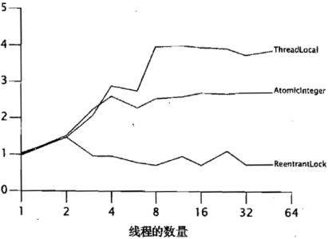
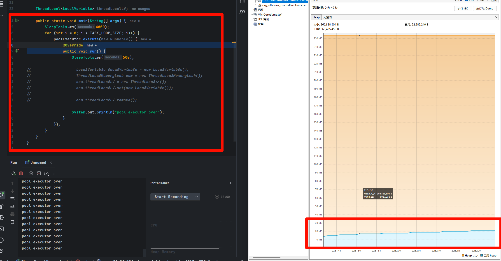
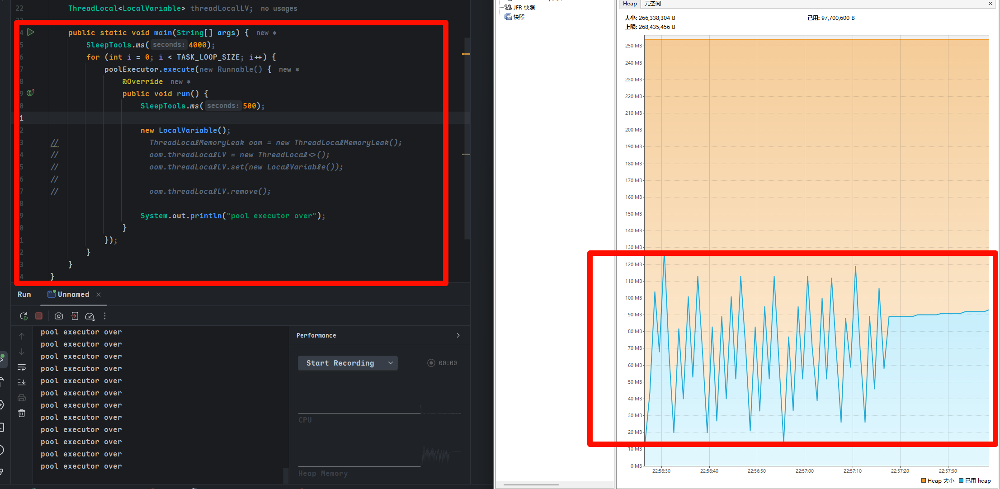
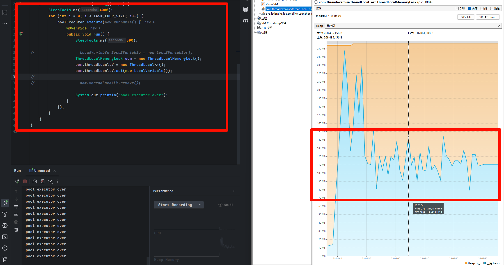
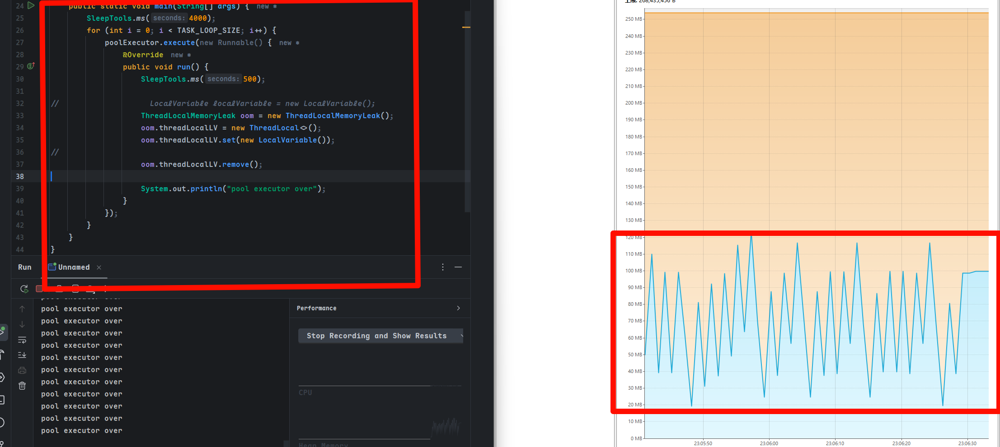
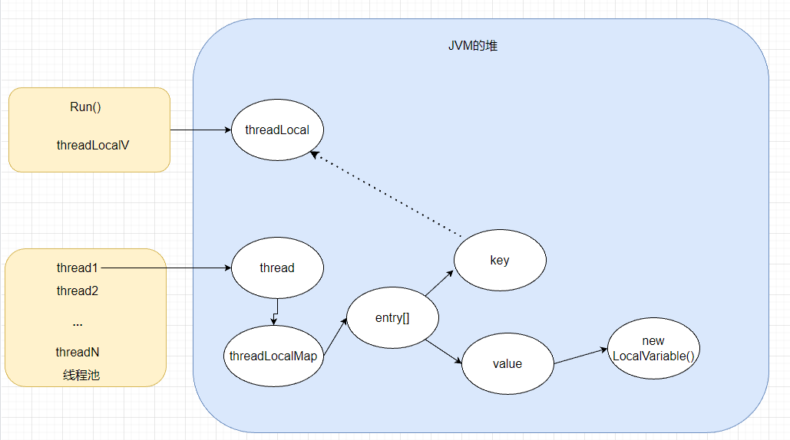

### 为什么需要ThreadLocal？

在早期还在使用JDBC的时候。sql语句需要从数据库连接池拿出一个连接。通过这个连接结合代码中编写的sql语句对数据库数据进行操作。

有时候我们的业务需要操作多个数据库表，为了错误恢复，引入了事务。但是JDBC中每个sql操作都开启了一个事务，这就导致业务逻辑执行的sql如果有错误并不能正确处理。

如何将这些sql放在一个事务下面呢？将这些sql指定同一个连接就行了。这就不可避免了传参要加入连接这个参数。

在spring中dao和service层我们不可能在者两个地方传入数据库连接参数这种方式。那么Spring的事务是怎么处理的呢？Spring的事务注解`Transcation`中将连接绑定到线程中。最后通过ThreadLocal的方式实现`绑定连接到线程`中。

ThreadLocal类

提供线程的局部变量，这些变量与普通变量的不同之处在于，访问变量的每个线程都有自己的初始化变量副本。这使得他们不用访问公共资源。也就不需要锁就能实现资源利用。无论是多少线程并发都是线程安全的。

ThreadLocal的一个应用场景是跨方法参数传递，如Web容器中，每个请求都会由一个线程来处理，结合ThreadLocal再使用IOC和AOP就可以很好解决事务问题。只要将一个数据库连接放入ThreadLocal中，执行时拿出来操作就可以了。或者是在分布式服务中进行链路追踪，traceId也是利用了ThreadLocal。

#### ThreadLocal的使用

ThreadLocal 实际上跟Map的使用差不多。只有四个方法。set、get、remove、initialValue。光看方法名称就知道是什么作用了。需要注意的是，remove方法最好每次使用后，后续如果不再使用的时候执行移除。加快内存回收速度。

既然ThreadLocal只是一个map的作用，为什么我们不自己实现一个呢？

自己基于Map实现的ThreadLocal没有官方实现的性能测试好。




在《Java并发编程实战》这本书种，DouLee给出了性能测试图。自己实现的ThreadLocal Map实际情况下跟ReentranLock差不多。那么为什么ThreadLocal有这么高的性能呢。

ThreadLocal成为了Thread的参数。也就是说，每个Thread都有自己的ThreadLocal变量副本。这样就避免了线程之间的竞争。每个线程只需要从自己的ThreadLocal中获取变量副本就可以了。

并且，线程的变量副本数是不定的，有些线程可能单独拥有几个副本，有些只拥有1个。线程内部存放这些副本就需要一个容器。并同时支持快速增删改查。Map刚好也能满足这个需求。

```Java
public class MyThreadLocal<T> {
    private Map<Thread, T> threadTMap = new HashMap<>();
    
    public synchronized T get() {
        return threadTMap.get(Thread.currentThread());
    }
    
    public synchronized void set(T t) {
        threadTMap.put(Thread.currentThread(), t);
    }
}
```

Thread 中 有一个ThreadLocalMap实现。ThreadLocalMap的实例化在Thread内部。ThreadLocalMap实现就是ThreadLocal的具体实现。参考与JDK1.7时候的Map实现，Map是根据数组+链表实现的。在ThreadLocalMap这里是也是根据数组，但是没有链表。

Map中的链表是为了针对哈希冲突而作的设计。ThreadLocal中针对哈希冲突采用的是**开放寻址法**。数组采用Entry数组。Enty是一个键值对。键为ThreadLocal，值是任意类型。

```java
    static class ThreadLocalMap {

        /**
         * The entries in this hash map extend WeakReference, using
         * its main ref field as the key (which is always a
         * ThreadLocal object).  Note that null keys (i.e. entry.get()
         * == null) mean that the key is no longer referenced, so the
         * entry can be expunged from table.  Such entries are referred to
         * as "stale entries" in the code that follows.
         */
        static class Entry extends WeakReference<ThreadLocal<?>> {
            /** The value associated with this ThreadLocal. */
            Object value;
		// 类似于map的key value 结构，key是ThreadLocal，Value就是要隔离访问的变量
            Entry(ThreadLocal<?> k, Object v) {
                super(k);
                value = v;
            }
        }

        /**
         * The initial capacity -- MUST be a power of two.
         */
        private static final int INITIAL_CAPACITY = 16;

        /**
         * The table, resized as necessary.
         * table.length MUST always be a power of two.
         */
        // 用数组保存Entry，有可能有多个变量，需要线程隔离访问
        private Entry[] table;
        
        //...
    }
```

Entry继承了WeakReference<ThreadLocal>，表明这里这个ThreadLocal键是一个弱引用类型，可以被GC回收。

get和set方法对应map就不再赘述。看源码即可。

前文提到，哈希冲突根据开放寻址法进行处理，ThreadLocal是根据开放寻址法中的**线性探测再散列**完成的。即有冲突则 + 1，还有冲突 + 1.一直到没有冲突的位置。

```java
/**
 * Version of getEntry method for use when key is not found in
 * its direct hash slot.
 *
 * @param  key the thread local object
 * @param  i the table index for key's hash code
 * @param  e the entry at table[i]
 * @return the entry associated with key, or null if no such
 */
private Entry getEntryAfterMiss(ThreadLocal<?> key, int i, Entry e) {
    Entry[] tab = table;
    int len = tab.length;

    while (e != null) {
        if (e.refersTo(key))
            return e;
        if (e.refersTo(null))
            expungeStaleEntry(i);
        else
            i = nextIndex(i, len);
        e = tab[i];
    }
    return null;
}

/**
 * Increment i modulo len.
 */
private static int nextIndex(int i, int len) {
    return ((i + 1 < len) ? i + 1 : 0);
}
```

介绍完ThreadLocal的基本情况，下面来分析一下可能发生的内存泄露问题

### ThreadLocal 内存泄露分析

在了解他的内存泄漏问题之前，首先得知道什么是弱引用和强引用。

引用

Object o = new Object() o被称作对象引用。new Object则是在堆上新建了一个对象实例。o则放在线程栈上指向堆中的实例。如果下一步是 o = null，则o不再指向object中的对象实例。这并不代表这个对象实例不存在了。

强引用时指这类 Object o = new Object()中直接被new 或者 Object o1 = o 这类对象。只要强引用存在，GC就不会堆堆进行垃圾回收。

软引用时用来描述一些有用蛋不是必须的对象，对于软引用关联的对象，在系统将要发生内存溢出之前，会把位于回收范围内的对象实例进行二次回收。如果这次回收还没有足够的内存才会抛出溢出异常。在JDK1.2之后，提了SoftReference类实现软引用。

弱引用也是用来描述非必须对象的，但就是他比软引用更弱一些。被弱引用关联的对象只能在下一次GC的之前生效。

##### 内存泄漏现象

执行代码

```java
public class ThreadLocalMemoryLeak {
    private static final int TASK_LOOP_SIZE = 500;

    // 线程池
    final static ThreadPoolExecutor poolExecutor
            = new ThreadPoolExecutor(5, 5, 1,
            TimeUnit.MINUTES,
            new LinkedBlockingDeque<>());

    // 5M大小数组
    static class LocalVariable {
        private byte[] a = new byte[1024 * 1024 * 5];
    }

    ThreadLocal<LocalVariable> threadLocalLV;

    public static void main(String[] args) {
        SleepTools.ms(4000);
        for (int i = 0; i < TASK_LOOP_SIZE; i++) {
            poolExecutor.execute(new Runnable() {
                @Override
                public void run() {
                    SleepTools.ms(500);

//                    LocalVariable localVariable = new LocalVariable();
//                    ThreadLocalMemoryLeak oom = new ThreadLocalMemoryLeak();
//                    oom.threadLocalLV = new ThreadLocal<>();
//                    oom.threadLocalLV.set(new LocalVariable());
//
//                    oom.threadLocalLV.remove();

                    System.out.println("pool executor over");
                }
            });
        }
    }
}

public class SleepTools {

    /**
     * 按秒休眠
     * @param seconds 秒数
     */
    public static final void second(int seconds) {
        try {
            TimeUnit.SECONDS.sleep(seconds);
        } catch (InterruptedException e) {
        }
    }

    /**
     * 按毫秒数休眠
     * @param seconds 毫秒数
     */
    public static final void ms(int seconds) {
        try {
            TimeUnit.MILLISECONDS.sleep(seconds);
        } catch (InterruptedException e) {
        }
    }
}

```

在idea配置中将代码的JVM虚拟机参数设置为 -Xmx256m。

场景1：执行代码但是线程逻辑中不含任何操作，可以发现应用在堆上耗费的内存大概在20m左右。



场景2：只执行简单的new一个数组，发现触发了GC回收，比较于场景1平均最低内存消耗略有增加。



场景3：启用ThreadLocal



可以看到，平均最低内存更高了，变到100M左右

场景4：增加remove



回到了场景2差不多的水平。这就能说明，启用了ThreadLocal后确实是发生了内存泄漏问题。

分析

每个Thread中维护一个ThreadLocalMap，而ThreadLocalMap是一个Entry数组实现的Map。Entry 继承于WeakReference。key是ThreadLocal本身。value是需要存储的Object。ThreadLocal本身不存储值，是用来映射value的。而这个key是一个弱引用类型，会在GC的时候被回收。



虚线表示弱引用。当把threadLocal设置为null后。将没有任何强引用指向threadLocal实例，就会被GC回收。导致key为null。但是value指向的new LocalVariable()有一条强引用链。线程如果不结束，这条链就一直存在。(thread->threadLocalMap->entry->value->new LocalVariable)。这条连接永远不会被访问到，所以存在内存泄漏。

当thread结束后，currentThread就不会在栈中，强引用断开，这时候Map Value和currentThread都会被GC回收。最好的做法就是在不使用ThreadLocal变量后用remove方法手动移除。

在场景3中，因为最后没有手动remove，所以5个线程最后都包含自己的new LocalVariable。

实际上，ThreadLocal的get或者set在某些时候都会手动调用expungeStaleEntry方法手动清除Entry中Key为null的value。但是是不及时的，也不是每次都会执行，一些情况下还是会发生内存泄漏问题。只有remove方法显示的调用了expungeStaleEntry方法。


为什么是弱引用而不是强引用？

key使用强引用，当threadLocal对象实例引用设置为null，但是ThreadLocalMap还保留这个threadLocal对象的强引用。如果 没有手动删除，ThreadLocal对象不会回收，导致内存泄漏。

key使用弱引用，当threadLocal对象实例引用设置为null，即使没有手动回收，threadLocal对象也会被回收，当value在下一次threadLocalMap调用set，get，remove都有机会被会回收。

比较两种情况，可以发现threadLocal生命周期跟thread一致。如果没有手动删除key，都会导致内存泄漏，但是弱引用能多一层保障。

所以，JVM利用设置ThreadLocalMap的key为弱引用来避免内存泄漏。get、set、remove方法都会回收弱引用。

当ThreadLocal中包含很多Key为null的Entry的时候，没有调用remove、set、get方法就会导致内存泄漏。

使用线程池 + ThreadLocal要小心，这种情况下线程是重复运行的，如果没有回收value可能导致堆内存爆炸的情况。


使用中，让每个线程中的ThreadLocal都应该保持一个新的对象。使用initialValue进行初始化。否则会导致多个线程中的对象都是一样的。修改不生效。
