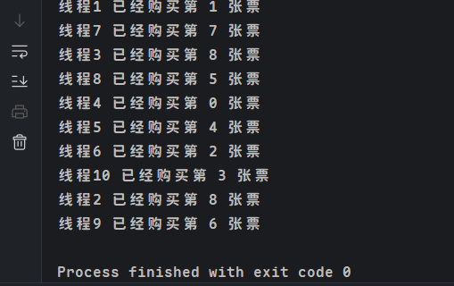
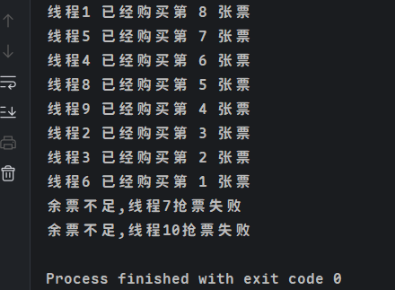
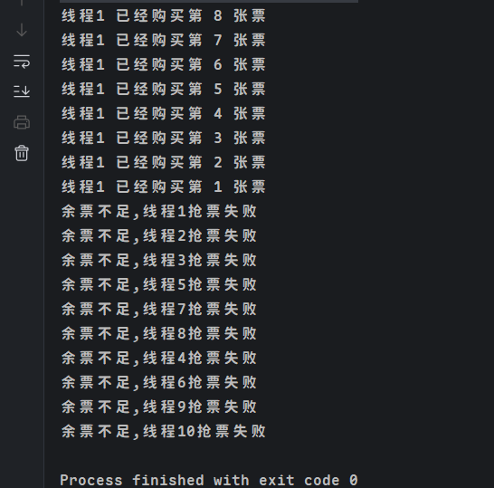

> [!note]
>
> 前言:
>
> 并发的内容比较多，需要有一个全局的思维。类似一个思维导图，再逐步细分到各个点，这样学习起来会轻松一点，同时呢，在复习的时候，也比较容易知道自己哪一点有遗忘或者不清楚。
>
> 实际上别的内容学习也是差不多的。也可以用相同的思维方式学习。但是呢也不可操之过急，思维和行为不是一天能够改变的。需要日积月累, 相信最后会有所收获。
>
> 本篇内容比较注重于上手实践，同时也记录一些学习中存在的问题。

### ReentrantLock

ReentrantLock可重入锁，独占锁。允许一个线程重复获取一个锁而不被阻塞。

功能类似于synchronized的互斥锁，可以保证线程安全。

想比较于synchronized，具有如下特点

- **可中断**：lockInterruptibly可被中断的获取锁。lock和synchoronized是不可中断的。
- 可以设置**超时时间**
- **是否公平锁**
- 设置多个**条件变量**

- **与synchronized一样，支持可重入** synchronized 可递推调用，但是不可多线程调用，会阻塞。

ReentrantLock主要运用于**多线程**下对某些资源的**独占访问**，保证**数据一致性和安全性**。

#### 公平锁和非公平锁

什么是公平锁呢？比如银行取钱，必须是排队等号。叫到号的才能够取钱。把人抽象成线程，这种有顺序的，对每个人(线程)来说都是公平的叫做公平锁。

什么是非公平锁？比如高铁安检。一般来说都是按顺序的，但是如果有人赶时间就大家都允许他插队过安检。这就是非公平锁。允许线程不按照一定顺序，先执行。

常用方法

|                             方法                             |                             描述                             |
| :----------------------------------------------------------: | :----------------------------------------------------------: |
|                         void lock()                          |   获取锁，调用该方法当前线程会获取锁，当拿到锁后，方法返回   |
|                        void unlock()                         |                 释放锁，跟lock()一起搭配使用                 |
|     void lockInterruptibly() throws InterruptedException     | 可中断的获取锁，和lock()方法不同之处在于该方法会响应中断，即在锁的获取中可以中断当前线程 |
|                      boolean tryLock()                       |  尝试非阻塞的获取锁，如果能获取锁就返回true，否则返回false   |
| boolean tryLock(long time, TimeUnit unit) throws InterruptedException | 超时获取锁，当前线程在下面三种情况下会被返回:当前线程超时时间内获取到锁<br />当前线程在超时时间内被中断<br />超时时间结束，返回false |
|                   Condition newCondition()                   | 获取等待通知组件，该组件和当前的锁绑定，当前线程只有获取了锁，才能调用该组件的await()方法，调用后，当前线程释放锁。 |

> [!note]
>
> 1. 默认情况下RenntrantLock为非公平锁。
> 2. 加锁要放在try之前，这样可以避免未加锁成功又释放锁的情况。
> 3. 释放锁要在finally中，否则会导致线程阻塞。
> 4. 加锁次数和释放锁次数要保持一致，否则会导致线程阻塞或者程序异常。

下面是一个ReetrantLock的加锁例子。

```java
public class ReentrantLockTickets {
    private final ReentrantLock lock = new ReentrantLock();
    private static int tickets = 8;

    public void buyTicket() {
        // 加锁
        lock.lock();
        try {
            if (tickets > 0) {
                Thread.sleep(10);
                System.out.println(Thread.currentThread().getName() + " 已经购买第 " + tickets-- + " 张票");
                // 递归的可重复锁实验
                buyTicket();
            } else {
                System.out.println("余票不足," + Thread.currentThread().getName() + "抢票失败");
            }
        } catch (Exception e) {
            e.printStackTrace();
        } finally {
            // 要做finally 释放锁
            lock.unlock();
        }
    }

    public static void main(String[] args) {
        ReentrantLockTickets t = new ReentrantLockTickets();
        for (int i = 1; i <= 10; i++) {
            // 10个线程操作
            Thread thread = new Thread("线程" + i) {
                @Override
                public void run() {
                    t.buyTicket();
                }
            };
            thread.start();
        }
    }
}
```

如果把lock.lock()和lcok.unlock()、buyTicket()的递归注释掉，那么结果会出现买到票数为负数或者同一张票卖给多个人的情况。



如果只是注释掉buyTicket()。也就是单纯加锁，就不会出现这种情况，一切正常。8张票给8个人，多的两个人买不到票。



如果什么都不做，直接允许。那么就会出现8张票全被一个人买到的黄牛行为。这也是可重入锁的体现。



#### 可重入锁

可重入锁又叫递归锁，可以重复对同一个对象加锁。但是要注意释放锁的次数。一般来说加了多少把锁就要释放多少把锁。否则会导致线程阻塞或者程序崩溃。这种加锁方式不会导致线程阻塞。Synchronized 和 ReentrantLock都是可重入锁，可重入锁一定程度上能够避免死锁。

在实际开发中，可重入锁一半运用于同一个类中方法间的锁，递归操作，锁嵌套等场景。
注意Condition 的 await和signal需要在lock中使用。

#### 生产者和消费者模式

结合Condition和等待通知机制能够实现生产者和消费者模式。Conditon.await()用来使线程等待，Condition.signalAll()或者Condition.signal()用来唤醒等待的线程。

```java
class Queue {
    private Object[] items;
    int size = 0;
    int takeIndex;
    int putIndex;
    private ReentrantLock lock;
    public Condition notEmpty;
    public Condition notFull;

    public Queue (int capacity) {
        this.items = new Object[capacity];
        lock = new ReentrantLock();
        notEmpty = lock.newCondition();
        notFull = lock.newCondition();
    }

    public void put(Object value) throws Exception{
        lock.lock();
        try {
            while (size == items.length) {
                notFull.await();
            }
            items[putIndex] = value;
            putIndex ++;
            if (putIndex == items.length) {
                putIndex = 0;
            }
            size ++;
            notEmpty.signal();
        } finally {
            System.out.println("producer生产: " + value);
            lock.unlock();
        }
    }

    public Object get() throws Exception {
        lock.lock();
        Object value = null;
        try {
            while (size == 0) {
                notEmpty.await();
            }
            value = items[takeIndex];
            takeIndex ++;
            if (takeIndex == items.length) {
                takeIndex = 0;
            }
            size --;
            notFull.signal();
            return value;
        } finally {
            lock.unlock();
        }
    }
}

class Producer implements Runnable {
    private Queue queue;

    public Producer(Queue queue) {
        this.queue = queue;
    }

    @Override
    public void run() {
        try {
            while (true) {
                Thread.sleep(1000);
                queue.put(new Random().nextInt(1000));
            }
        } catch (Exception e) {
            e.printStackTrace();
        }
    }
}

class Consumer implements Runnable {
    private Queue queue;

    public Consumer (Queue queue) {
        this.queue = queue;
    }

    @Override
    public void run() {
        try {
            while (true) {
                Thread.sleep(2000);
                System.out.println("消费者消费: " + queue.get());
            }
        } catch (Exception e) {
            e.printStackTrace();
        }
    }
}

public class test {
    public static void main(String[] args) {
        Queue queue = new Queue(5);
        new Thread(new Producer(queue)).start();
        new Thread(new Consumer(queue)).start();
    }
}
```

ReentrantLock 应用场景:
- 多线程资源竞争问题: 多个线程竞争同一个数据库进行读写操作，可以保持每次只有一个线程对数据库资源进行读写。
- 多线程顺序执行问题: 多线程顺序执行，只有前面的一个线程执行完才能让后面的线程执行。
- 多线程的等待通知机制: 通过Condition的await和signal实现生产者消费者模型或者等待通知机制。当一个任务完成时，通知另外一个任务执行。

### Seamaphore

Semaphore 信号量，区别于synchronized和ReentrantLock这类可重入锁，可以一直重复访问某个资源，Semaphore限制了对某一个资源的访问线程数量。当访问线程数达到了Semaphore设置的访问数量，其他线程要访问这个资源，只能进入阻塞状态。等待正在访问的多个线程中的任何一个资源释放，才能访问资源。

Semaphore 信号量维护了一个计数器。其中有两个方法，一个是acquire()获取资源并使得计数器-1，另一个是release()释放资源使得计数器+1。当计数器为0时获取不到资源。线程阻塞。直到有线程释放资源。

tryAcquire()的思想和ReentranLock的tryLock()差不多。如果有资源能够尝试获取到，那么返回一个true。如果获取不到返回false，并且不会影响到正在acquire()获取资源的线程。
Seamphore 初始化有两个属性，一个是permit，表示允许访问资源的数量。一个是fair，表示是否是公平锁。

> [!note]
>
> Semaphore在使用上也是与ReentrantLock差不多，在finally块进行资源释放。不同的是在try块中进行acquire()请求资源。

```java
public class test {
    private static Semaphore semaphore = new Semaphore(2);

    private static Executor executor = Executors.newFixedThreadPool(10);


    public static String getProductInfo() {
        try {
            semaphore.acquire();
            log.info("请求服务");
            Thread.sleep(2000);
        } catch (InterruptedException e) {
            throw new RuntimeException(e);
        } finally {
            semaphore.release();
        }
        return "返回商品详情信息";
    }

    public static String getProductInfo1() {
        if (!semaphore.tryAcquire()) {
            log.error("请求限流");
            return "请求被限流";
        }
        try {
            log.info("请求服务");
            Thread.sleep(2000);
        } catch (InterruptedException e) {
            throw new RuntimeException(e);
        } finally {
            semaphore.release();
        }
        return "返回商品详情信息";
    }

    public static void main(String[] args) {
        for (int i = 0; i < 10; i++) {
            executor.execute(() -> getProductInfo1());
        }
    }
}
```

再来看一个模拟数据库连接池的例子

```java
/**
 * 数据库连接
 */
class Connect {
    private static int count = 1;
    private int id = count ++;

    public Connect (){
        // 假设打开一个连接很耗费资源，需要等待1秒
        try {
            Thread.sleep(1000);
        } catch (InterruptedException e) {
            e.printStackTrace();
        }
        System.out.println("连接#" + id + "#已与数据库建立通道! ");
    }
    @Override
    public String toString() {
        return  "#" + id + "#";
    }
}

// 数据库连接池
class ConnectPool {
    private int size;
    private Connect[] connects;

    // 记录对应下标的Connect是否已被使用
    private boolean[] connectFlag;

    private Semaphore semaphore;

    /**
     * size: 初始化连接池大小
     */
    public ConnectPool(int size) {
        this.size = size;
        semaphore = new Semaphore(size, true);
        connects = new Connect[size];
        connectFlag = new boolean[size];
        // 初始化连接池
        initConnects();
    }

    private void initConnects() {
        for (int i = 0; i < this.size; i++) {
            connects[i] = new Connect();
        }
    }

    /**
     * 获取数据库连接
     */
    public Connect openConnect() throws InterruptedException {
        // 得先获得使用许可证，如果信号量为0，则拿不到许可证，一直阻塞直到能获得
        semaphore.acquire();
        return getConnect();
    }

    private synchronized Connect getConnect() {
        for (int i = 0; i < connectFlag.length; i++) {
            if (!connectFlag[i]) {
                // 标记改连接已被使用
                connectFlag[i] = true;
                return connects[i];
            }
        }
        return null;
    }

    /**
     * 释放某个数据库连接
     */
    public synchronized void releaseConnect(Connect connect) {
        for (int i = 0; i < this.size; i++) {
            if (connect == connects[i]) {
                connectFlag[i] = false;
                semaphore.release();
            }
        }
    }
}

public class test {
    final static ExecutorService excutorService = Executors.newCachedThreadPool();

    public static void main(String[] args) {
        final ConnectPool pool = new ConnectPool(2);

        // 5个线程并发竞争抢连接资源
        for (int i = 0; i < 5; i++) {
            final int id = i + 1;
            excutorService.execute(new Runnable() {
                @Override
                public void run() {
                    Connect connect = null;
                    try {
                        System.out.println("线程" + id + "等待获取数据库连接");
                        connect = pool.openConnect();
                        System.out.println("线程" + id + "已经拿到数据库连接" + connect);
                        // 进行数据库操作2秒后释放
                        Thread.sleep(2000);
                        System.out.println("线程" + id + "释放数据库连接" + connect);
                    } catch (InterruptedException e) {
                        e.printStackTrace();
                    } finally {
                        pool.releaseConnect(connect);
                    }
                }
            });
        }
    }
}
```

ReentrantLock 应用场景:

- 多线程资源竞争问题: 多个线程竞争同一个数据库进行读写操作，可以保持每次只有一个线程对数据库资源进行读写。
- 多线程顺序执行问题: 多线程顺序执行，只有前面的一个线程执行完才能让后面的线程执行。
- 多线程的等待通知机制: 通过Condition的await和signal实现生产者消费者模型或者等待通知机制。当一个任务完成时，通知另外一个任务执行。

### Semaphore 信号量

区别于synchronized和ReentrantLock这类可重入锁，可以一直重复访问某个资源，Semaphore限制了对某一个资源的访问线程数量。当访问线程数达到了Semaphore设置的访问数量，其他线程要访问这个资源，只能进入阻塞状态。等待正在访问的多个线程中的任何一个资源释放，才能访问资源。

Semaphore 信号量维护了一个计数器。其中有两个方法，一个是acquire()获取资源并使得计数器-1，另一个是release()释放资源使得计数器+1。当计数器为0时获取不到资源。线程阻塞。直到有线程释放资源。
tryAcquire()的思想和ReentranLock的tryLock()差不多。如果有资源能够尝试获取到，那么返回一个true。如果获取不到返回false，并且不会影响到正在acquire()获取资源的线程。

Seamphore 初始化有两个属性，一个是permit，表示允许访问资源的数量。一个是fair，表示是否是公平锁。

Semaphore在使用上也是与ReentrantLock差不多，在finally块进行资源释放。不同的是在try块中进行acquire()请求资源。

```Java
public class test {
    private static Semaphore semaphore = new Semaphore(2);

    private static Executor executor = Executors.newFixedThreadPool(10);


    public static String getProductInfo() {
        try {
            semaphore.acquire();
            log.info("请求服务");
            Thread.sleep(2000);
        } catch (InterruptedException e) {
            throw new RuntimeException(e);
        } finally {
            semaphore.release();
        }
        return "返回商品详情信息";
    }

    public static String getProductInfo1() {
        if (!semaphore.tryAcquire()) {
            log.error("请求限流");
            return "请求被限流";
        }
        try {
            log.info("请求服务");
            Thread.sleep(2000);
        } catch (InterruptedException e) {
            throw new RuntimeException(e);
        } finally {
            semaphore.release();
        }
        return "返回商品详情信息";
    }

    public static void main(String[] args) {
        for (int i = 0; i < 10; i++) {
            executor.execute(() -> getProductInfo1());
        }
    }
}
```

模仿数据库连接池

```java
/**
 * 数据库连接
 */
class Connect {
    private static int count = 1;
    private int id = count ++;

    public Connect (){
        // 假设打开一个连接很耗费资源，需要等待1秒
        try {
            Thread.sleep(1000);
        } catch (InterruptedException e) {
            e.printStackTrace();
        }
        System.out.println("连接#" + id + "#已与数据库建立通道! ");
    }
    @Override
    public String toString() {
        return  "#" + id + "#";
    }
}

// 数据库连接池
class ConnectPool {
    private int size;
    private Connect[] connects;

    // 记录对应下标的Connect是否已被使用
    private boolean[] connectFlag;

    private Semaphore semaphore;

    /**
     * size: 初始化连接池大小
     */
    public ConnectPool(int size) {
        this.size = size;
        semaphore = new Semaphore(size, true);
        connects = new Connect[size];
        connectFlag = new boolean[size];
        // 初始化连接池
        initConnects();
    }

    private void initConnects() {
        for (int i = 0; i < this.size; i++) {
            connects[i] = new Connect();
        }
    }

    /**
     * 获取数据库连接
     */
    public Connect openConnect() throws InterruptedException {
        // 得先获得使用许可证，如果信号量为0，则拿不到许可证，一直阻塞直到能获得
        semaphore.acquire();
        return getConnect();
    }

    private synchronized Connect getConnect() {
        for (int i = 0; i < connectFlag.length; i++) {
            if (!connectFlag[i]) {
                // 标记改连接已被使用
                connectFlag[i] = true;
                return connects[i];
            }
        }
        return null;
    }

    /**
     * 释放某个数据库连接
     */
    public synchronized void releaseConnect(Connect connect) {
        for (int i = 0; i < this.size; i++) {
            if (connect == connects[i]) {
                connectFlag[i] = false;
                semaphore.release();
            }
        }
    }
}

public class test {
    final static ExecutorService excutorService = Executors.newCachedThreadPool();

    public static void main(String[] args) {
        final ConnectPool pool = new ConnectPool(2);

        // 5个线程并发竞争抢连接资源
        for (int i = 0; i < 5; i++) {
            final int id = i + 1;
            excutorService.execute(new Runnable() {
                @Override
                public void run() {
                    Connect connect = null;
                    try {
                        System.out.println("线程" + id + "等待获取数据库连接");
                        connect = pool.openConnect();
                        System.out.println("线程" + id + "已经拿到数据库连接" + connect);
                        // 进行数据库操作2秒后释放
                        Thread.sleep(2000);
                        System.out.println("线程" + id + "释放数据库连接" + connect);
                    } catch (InterruptedException e) {
                        e.printStackTrace();
                    } finally {
                        pool.releaseConnect(connect);
                    }
                }
            });
        }
    }
}
```

Semaphore 常用于: 共享资源的限流处理 实现资源池，维护有限的共享资源。

### CountDownLatch 

是一个同步协助类，用于一个或者多个线程等待，直到其他线程相关逻辑完成的情况。

CountDownLatch常用方法

await让线程等待，直到countDown将值减到0自动唤醒。
countdown 将设置的count数-1，如果是在减之前为0则什么也不发生。如果在减之前大于0则-1。减后为0唤醒所有等待线程。

CountDownLatch 初始化传入一个count，表示需要调用 countDown() 的次数，而不是“允许同时唤醒的线程数量”。当count 为0时候，所有的CpimtDownLatch的await线程都会被唤醒。

eg：运动比赛

```java
public class test {
    // 裁判 1位
    private static CountDownLatch judge = new CountDownLatch(1);

    // 参赛者 8位
    private static CountDownLatch player = new CountDownLatch(8);

    public static void main(String[] args) throws InterruptedException{
        for (int i = 1; i <= 8; i++) {
            new Thread(new Runnable() {
                @SneakyThrows
                @Override
                public void run() {
                    // 预备状态
                    System.out.println("参赛者" + Thread.currentThread().getName() + "已经准备好了");
                    // 等待裁判吹哨
                    judge.await();
                    System.out.println("参赛者" + Thread.currentThread().getName() + "开始比赛");
                    Thread.sleep(3000);
                    System.out.println("参赛者" + Thread.currentThread().getName() + "到达终点");
                    // 参赛者计数器 - 1
                    player.countDown();
                }
            }).start();
        }
        // 等待5s裁判吹哨
        Thread.sleep(5000);
        System.out.println("比赛开始");
        judge.countDown();
        //等待所有人到达终点
        player.await();
        System.out.println("比赛结束");
    }
}
```

eg: 收集资源

```
public class test {
    public static void main(String[] args) throws Exception{
        CountDownLatch countDownLatch = new CountDownLatch(5);
        for (int i = 0; i < 5; i++) {
            final int index = i;
            new Thread(() -> {
                try {
                    Thread.sleep(1000 + ThreadLocalRandom.current().nextInt(2000));
                    System.out.println("任务" + index + "执行完成");
                    countDownLatch.countDown();
                } catch (InterruptedException e) {
                    e.printStackTrace();
                }
            }).start();
        }

        // 主线程在阻塞，当计数器为0，就唤醒主线程往下执行
        countDownLatch.await();
        System.out.println("主线程:在所有任务运行完成后，今日结果汇总");
    }
}
```

CountDownLatch 常见使用场景

并行任务同步: 协调多个线程完成情况，多线程收集或者处理资源结束后进行下一步动作。
资源初始化：多线程收集资源结束后，主线程才能继续运行。
多任务汇总：统计多个线程的完成情况，并进行汇总。确定所有线程都完成。


### CycliBarrier

CycliBarrier 与CountDownLatch不同的是，可以多次使用。CountDownLatch只能用一次。
CycliBarrier 叫做回环栅栏或者循环屏障。可以实现让一组线程等待到某个状态(屏障节点)后再全部同时运行。“回环”和“循环”指的是当所有线程被释放后，CycliBarrier还能重复利用。

CycliBarrier方法 
await()用于阻塞线程，直到所有线程都到达屏障。
reset()用于重置屏障，使其可以重复使用。如果有线程正在等待，会中断他，抛出BrokenBarrierException异常。

构造方法
CycliBarrier(int parties) 创建一个屏障，指定需要等待的线程数。
CycliBarrier(int parties, Runnable barrierAction) 创建一个屏障，当线程都到达屏障后执行barrierActon的方法。

eg: 等车

```Java
private static ExecutorService executorService = Executors.newFixedThreadPool(5);

    public static void main(String[] args) {
        CyclicBarrier cyclicBarrier = new CyclicBarrier(5, () -> System.out.println("人齐了，准备发车"));

        for (int i = 0; i < 10; i++) {
            final int id = i + 1;
            executorService.submit(new Runnable() {
                @Override
                public void run() {
                    try {
                        System.out.println(id + "号马上就到");
                        int sleepMills = ThreadLocalRandom.current().nextInt(2000);
                        Thread.sleep(sleepMills);
                        System.out.println(id + "号到了，上车");
                        cyclicBarrier.await();
                    } catch (InterruptedException e) {
                        e.printStackTrace();
                    } catch (BrokenBarrierException e) {
                        e.printStackTrace();
                    }
                }
            });
        }
    }

public class test {
    public static void main(String[] args) {
        // 生成数据 任务分工
        List<Integer> data = new ArrayList<>();
        for (int i = 1; i <= 50; i++) {
            data.add(i);
        }

        // 指定数据处理大小
        int batchSize = 5;
        CyCLIBarrierBatchProcessor processor = new CyCLIBarrierBatchProcessor(data, batchSize);
        // 处理数据
        processor.process(batchData -> {
            for (Integer i : batchData) {
                System.out.println(Thread.currentThread().getName() + "处理数据" + i);
            }
        });
    }

}
```


eg：分块/分批处理任务

``` Java
class CyCLIBarrierBatchProcessor {
    private List<Integer> data;
    private int batchSize;
    private CyclicBarrier barrier;
    private List<Thread> threads;

    public CyCLIBarrierBatchProcessor(List<Integer> data, int batchSize) {
        this.data = data;
        this.batchSize = batchSize;
        this.barrier = new CyclicBarrier(batchSize);
        this.threads = new ArrayList<>();
    }

    public void process(BatchTask task) {
        // 对任务分批。获取线程数
        int threadCount = (data.size() + batchSize - 1) / batchSize;
        for (int i = 0; i < threadCount; i++) {
            int start = i * batchSize;
            int end = Math.min(start + batchSize, data.size());
            // 获取每个线程处理的任务数
            List<Integer> batchData = data.subList(start, end);
            Thread thread = new Thread(() -> {
                task.process(batchData);
                try {
                    barrier.await();
                } catch (InterruptedException | BrokenBarrierException e) {
                    e.printStackTrace();
                }
            });
            threads.add(thread);
            thread.start();
        }
    }

    public interface BatchTask {
        void process(List<Integer> batchData);
    }
}
```

应用场景

- 多线程任务需要同时进行

- 数据处理，在所有线程处理完后触发后续操作。

### Exchanger

用于两个线程之间交换数据的工具类。如果一个线程先执行了exchange方法，会同步等待另外一个线程执行exchange。只有两个线程执行了exchange方法后。才会进行数据交换。

Exchanger主要就两个方法

- exchange(V v)

等待另外一个线程也执行这个方法，除非当前线程被中断。然后将给定的对象v传给这个线程。并接受对方线程的对象。

- exchanger(V v, long timeout, TimeUnit unit)

等待另一个线程也执行这个方法，除非当前线程被中断，或者到达设定的时间(等候超时)，抛出超时异常。如果对方线程准备好了，交换对象v。

```java
public class ExchangerTest {
    private static Exchanger exchanger = new Exchanger();
    static String goods = "商品";
    static String money = "￥3000";

    public static void main(String[] args) throws InterruptedException {
        System.out.println("准备交易，一手交钱一手交货");

        // 卖家
        new Thread(new Runnable() {
            @Override
            public void run() {
                System.out.println("卖家到了，已经准备好货: " + goods);
                try {
                    String money = (String) exchanger.exchange(goods);
                    System.out.println("卖家收到钱: " + money);
                } catch (InterruptedException e) {
                    e.printStackTrace();
                }
            }
        }).start();


        Thread.sleep(3000);

        new Thread(new Runnable() {
            @Override
            public void run() {
                System.out.println("买家到了，已经准备好钱:" + money);
                try {
                    String goods = (String) exchanger.exchange(money);
                    System.out.println("买家收到货: " + goods);
                } catch (InterruptedException e) {
                    e.printStackTrace();
                }
            }
        }).start();
    }
}

```

eg：模拟对账

```java
public class ExchangeTest2 {
    private static final Exchanger<String> exchanger = new Exchanger<>();

    private static ExecutorService threadPool = Executors.newFixedThreadPool(2);

    public static void main(String[] args) {
        threadPool.execute(new Runnable() {
            @Override
            public void run() {
                try {
                    String a = "1234567890";
                    exchanger.exchange(a);
                } catch (InterruptedException e) {
                    e.printStackTrace();
                }
            }
        });

        threadPool.execute(new Runnable() {
            @Override
            public void run() {
                try {
                    String b = "123456asdf";
                    String a = exchanger.exchange(b);
                    System.out.println("A 和 B数据是否一致: "+ a.equals(b));
                    System.out.println("A= " + a);
                    System.out.println("B= " + b);
                } catch (InterruptedException e) {
                    e.printStackTrace();
                }
            }
        });
        threadPool.shutdown();
    }
}

```


eg: 交换队列，我认为是一种生产者消费者的无锁实现方式。当消费者队列为空的时候，触发交换机制。或者生产者满的时候交换。

```java
public class ExchangerTest3 {
    private static ArrayBlockingQueue<String> fullQueue = new ArrayBlockingQueue<>(5);

    private static ArrayBlockingQueue<String> emptyQueue = new ArrayBlockingQueue<>(5);

    private static Exchanger<ArrayBlockingQueue<String>> exchanger = new Exchanger<>();

    public static void main(String[] args) {
        new Thread(new Producer()).start();
        new Thread(new Consumer()).start();
    }

    /**
     * 生产者
     */
    static class Producer implements Runnable {

        @Override
        public void run() {
            ArrayBlockingQueue<String> current = emptyQueue;
            try {
                while (current != null) {
                    String str = UUID.randomUUID().toString();
                    try {
                        current.add(str);
                        System.out.println("producer: 生产了一个序列: " + str + ">>>>>加入到交换区");
                        Thread.sleep(2000);
                    } catch (IllegalStateException e) {
                        System.out.println("producer: 队列已经满了, 换一个空的");
                        current = exchanger.exchange(current);
                    }
                }
            } catch (Exception e) {
                e.printStackTrace();
            }
        }
    }

    /**
     * 消费者
     */
    static class Consumer implements Runnable {
        @Override
        public void run() {
            ArrayBlockingQueue<String> current = fullQueue;
            try {
                while (current != null) {
                    if (!current.isEmpty()) {
                        String str = current.poll();
                        System.out.println("consumer: 消耗一个序列: " + str);
                        Thread.sleep(1000);
                    } else {
                        System.out.println("consumer: 队列空了，换个满的");
                        current = exchanger.exchange(current);
                        System.out.println("consumer: 换满的成功~~~~~~~~~~~~~~~~~~~~~~~~~");
                    }
                }
            } catch (Exception e) {
                e.printStackTrace();
            }
        }
    }
}
```

Exchanger主要用于数据交换和数据采集。


### Phaser(了解)

Phaser阶段协同器是一个Java实现的并发工具类。用于协调多线程的执行。可以灵活的控制线程的执行顺序和阶段性执行。Phaser可以看成是CyclicBarrier和CountDownLatch的进阶版。他能自适应的调整并发线程数，动态增减线程数量。适用于在重复执行或者重用的情况。

#### 常用方法

- 构造方法

Phaser() 参与任务数0

Phaser(int parties): 指定初始参与任务数

Phaser(Phaser parent): 指定parent阶段器，子对象作为一个整体加入parent对象，当子对象没有参与者时，会自动从parent对象解除注册。

Phaser(Phaser parent, int parties): 指定parent阶段器和指定初始参与任务数量。

- 其他方法

增减参与任务数方法

int register() 增加一个任务数，返回当前阶段号。

int bulkRegister(int parties) 增加指定任务个数，返回当前阶段号。

int arriveAndDeregister() 减少一个任务数，返回当前阶段号。

到达、等待方法

int arrive()到达(任务完成), 返回当前阶段号。

int arriveAndAwaitAdvance() 到达后阻塞等待其他任务到达，返回到达阶段号。

int awaitAdvance(int phase) 在指定阶段等待(必须是当前阶段才有效)

int awaitAdvanceInterruptibly(int phase)阶段到达触发动作，可被中断抛出中断异常

int awaitAdvanceInterruptiBly(int phase，long timeout，TimeUnit unit) 带及时的可被中断的阶段触发动作。

protected boolean onAdvance(int phase，int registeredParties)类似CyclicBarrier的触发命令，通过重写该方法来增加阶段到达动作，该方法返回true将终结Phaser对象。

eg: 数据处理

```java
public class PhaserTest {
    private final List<String> data;

    // 一次处理多少条数据
    private final int batchSize;

    // 处理的线程数
    private final int threadCount;

    private final Phaser phaser;

    private final List<String> processedData;

    public PhaserTest(List<String> data, int batchSize, int threadCount) {
        this.data = data;
        this.batchSize = batchSize;
        this.phaser = new Phaser(1);
        this.threadCount = threadCount;
        this.processedData = new ArrayList<>();
    }

    public void process() {
        for (int i = 0; i < threadCount; i++) {
            phaser.register();
            new Thread(new BatchProcessor(i)).start();
        }
        phaser.arriveAndDeregister();
    }

    private class BatchProcessor implements Runnable {

        private final int threadIndex;

        public BatchProcessor (int threadIndex) {
            this.threadIndex = threadIndex;
        }

        @Override
        public void run() {
            int index = 0;
            while (true) {
                // 所有线程都到达这个点之前会被阻塞
                phaser.arriveAndAwaitAdvance();

                // 从未处理数据中找到一个可以处理的批次
                List<String> batch = new ArrayList<>();
                synchronized (data) {
                    while (index < data.size() && batch.size() < batchSize) {
                        String d = data.get(index);
                        if (!processedData.contains(d)) {
                            batch.add(d);
                            processedData.add(d);
                        }
                        index ++;
                    }
                }

                // 处理数据
                for (String d : batch) {
                    System.out.println("线程" + threadIndex + "处理数据" + d);
                }

                // 所有线程都处理完当前批次之前都会阻塞
                phaser.arriveAndAwaitAdvance();

                // 所有线程都处理完当前批次并且未被处理数据已经处理完之前都会阻塞
                if (batch.isEmpty() || index >= data.size()) {
                    phaser.arriveAndDeregister();
                    break;
                }
            }
        }
    }

    public static void main(String[] args) {
        // 数据准备
        List<String> data = new ArrayList<>();
        for (int i = 1; i <= 15; i++) {
            data.add(String.valueOf(i));
        }

        int batchSize = 4;
        int threadCount = 3;

        PhaserTest phaserTest = new PhaserTest(data, batchSize, threadCount);
        // 处理数据
        phaserTest.process();
    }
}

```


eg: 员工聚餐

当执行到phaser.arriveAndAwaitAdvance(); 的时候，必须等待所有在这个阶段的线程都到达才会继续。

当执行到phaser.arriveAndDeregister();的时候，表示活动/任务结束。

```java
public class phaserTest1 {
    public static void main(String[] args) {
        final Phaser phaser = new Phaser() {
            @Override
            protected boolean onAdvance(int phase, int registeredParties) {
                // 参与者数量，去除主线程
                int staffs = registeredParties - 1;
                switch (phase) {
                    case 0:
                        System.out.println("大叫都到公司了, 触出发去公园, 人数: " + staffs);
                        break;
                    case 1:
                        System.out.println("大家都到公园门口了, 出发去餐厅, 人数: " + staffs);
                        break;

                    case 2:
                        System.out.println("大家都到餐厅了, 开始用餐, 人数: " + staffs);
                        break;
                }

                // 判断是否只剩下主线程(一个参与者)，如果是，返回true 代表终止。
                return registeredParties == 1;
            }
        };

        // 注册主线程 -- 让主线程全程参与
        phaser.register();
        final StaffTask staffTask = new StaffTask();

        // 3个线程全程参与团建的员工
        for (int i = 0; i < 3; i++) {
            // 添加任务数
            phaser.register();
            new Thread(() -> {
                try {
                    staffTask.step1Task();
                    // 到达后等待其他任务到达
                    phaser.arriveAndAwaitAdvance();

                    staffTask.step2Task();
                    phaser.arriveAndAwaitAdvance();

                    staffTask.step3Task();
                    phaser.arriveAndAwaitAdvance();

                    staffTask.step4Task();
                    // 完成了，注销离开
                    phaser.arriveAndDeregister();
                } catch (InterruptedException e) {
                    e.printStackTrace();
                }
            }).start();
        }
        // 两个不聚餐的员工加入
        for (int i = 0; i < 2; i++) {
            phaser.register();
            new Thread(() -> {
                try {
                    staffTask.step1Task();
                    phaser.arriveAndAwaitAdvance();
                    
                    staffTask.step2Task();
                    System.out.println("员工【" + Thread.currentThread().getName() + "】回家了");
                    // 完成了，注销离开
                    phaser.arriveAndDeregister();
                } catch (InterruptedException e) {
                    e.printStackTrace();
                }
            }).start();
        }
        while (!phaser.isTerminated()) {
            int phase =  phaser.arriveAndAwaitAdvance();
            if (phase == 2) {
                // 到了去餐厅的阶段，又增加4人，参加晚上的聚餐
                for (int i = 0; i < 4; i++) {
                    phaser.register();
                    new Thread(() -> {
                        try {
                            staffTask.step3Task();
                            phaser.arriveAndAwaitAdvance();
                            
                            staffTask.step4Task();
                            // 完成了, 注销离开
                            phaser.arriveAndDeregister();
                        } catch (InterruptedException e) {
                            e.printStackTrace();
                        }
                    }).start();
                }
            }
        }
    }


    static final Random random = new Random();

    static class StaffTask {
        public void step1Task() throws InterruptedException {
            // 第一阶段：来公司集合
            String staff = "员工【" + Thread.currentThread().getName() + "】";
            System.out.println(staff + "从家出发了……");
            Thread.sleep(random.nextInt(5000));
            System.out.println(staff + "到达公司");
        }

        public void step2Task() throws InterruptedException {
            // 第二阶段：出发去公园
            String staff = "员工【" + Thread.currentThread().getName() + "】";
            System.out.println(staff + "出发去公园玩");
            Thread.sleep(random.nextInt(5000));
            System.out.println(staff + "到达公园门口集合");

        }

        public void step3Task() throws InterruptedException {
            // 第三阶段：去餐厅
            String staff = "员工【" + Thread.currentThread().getName() + "】";
            System.out.println(staff + "出发去餐厅");
            Thread.sleep(random.nextInt(5000));
            System.out.println(staff + "到达餐厅");

        }

        public void step4Task() throws InterruptedException {
            // 第四阶段：就餐
            String staff = "员工【" + Thread.currentThread().getName() + "】";
            System.out.println(staff + "开始用餐");
            Thread.sleep(random.nextInt(5000));
            System.out.println(staff + "用餐结束，回家");
        }
    }
}
```

Phaser 的应用场景

- 多线程任务分配 复杂的任务配分给多个线程执行，并协调合作
- 多线程任务流程 多级任务流程，并且允许每次执行线程数不一致
- 模拟并行计算 多线程准备完成后进行计算。
- 阶段性任务
