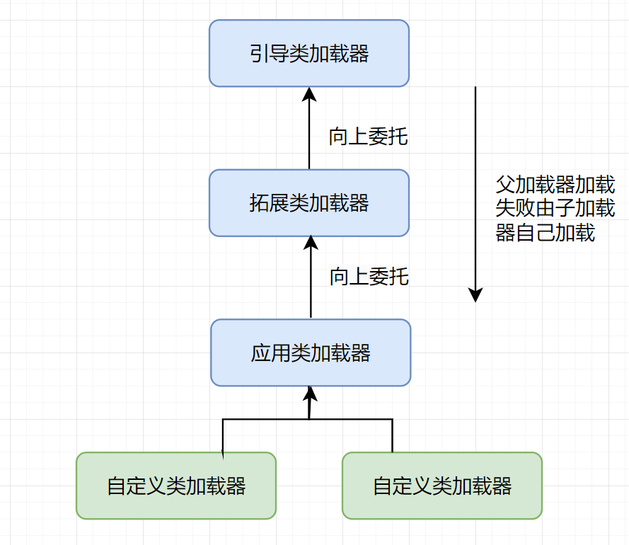

### Java类加载运行过程

当我们需要启动某个自己编写的类的时候，要编写非常经典的public static void main方法块。整个文件或者项目通过该main方法编译运行。那么是类是如何加载进内存的呢？

流程大致为

乍一看好像确实有点复杂，不过我们慢慢来，先将整个图抽象成2块。

左边由windows系统启动jvm.dll和创建引导类加载器实例实际上是spot完成的。这部分代码由C++编写。

右边粉色箭头开始直到红色 JVM销毁是由JAVA代码完成的。

loadClass的类加载过程为如下几步：

**加载->验证->准备->解析->初始化**->使用->卸载

>  [!note]
>
>  **加载**:将硬盘中的**字节码**文件(.class)进行读取。
>
>  **验证**:验证字节码文件的正确性。字节码文件格式是固定的。
>
>  **准备**:将类的静态变量分配内存，并给上默认值。这里的默认值不是指代码中给予的默认值。
>
>  **解析**:将**符号引用**替换为直接引用，该阶段会把一些静态方法(符号引用，比如main()方法)替换为指向数据所存内存的指针或句柄等(直接引用)，这是所谓的**静态链接**过程(类加载期间完成)，**动态链接**是在程序运行期间完成的将符号引用替换为直接引用。
>
>  >  [!Tip]
>  >
>  >  静态链接：就是将代码中的方法(main等自定义命名)以及类型(Integer)等内容抽象成符号，这部分符号又直接映射到内存表中，解析过程是将这些符号变成内存表中存储key，方便直接从内存表中获取value。
>  >
>  >  动态链接：方法中由抽象接口，多态等不能确定的类类型。只有在执行阶段才能确定的类型。
>
>  **初始化**：对类的静态变量给予代码中指定的值，并执行静态代码块。
>
>  

类被加载到方法区中后主要包含 **运行时常量池、类型信息、字段信息、方法信息、类加载器的引用、对应class实例的引用**等信息。

**类加载器的引用**：这个类到类加载器实例的引用

**对应class实例的引用**：类加载器在加载类信息放到方法区中后，会创建一个对应的Class 类型的对象实例放到堆(Heap)中, 作为开发人员访问方法区中类定义的入口和切入点。

> [!Warning] 
>
> 主类在运行过程中如果使用到其它类，会逐步加载这些类。
>
> jar包或war包里的类不是一次性全部加载的，是使用到时才加载。

### 类加载器初始化过程

一共有4种类加载器:

引导类加载器 ：负责加载支撑JVM运行的位于JRE的lib目录下的核心类库。

拓展类加载器 ExtClassLoader()：负责加载支撑JVM运行的位于JRE的lib目录下ext拓展目录的jar包。该加载器父加载器为null。因为引导类加载器是C++代码生成的。

> [!warning]
>
> JAVA 9之前。现在JAVA 9 之后将ExtClassLoader 转变成了 PlatformClassLoader。原来的ExtClassloader被替代。PlatformClassLoader 负责加载Java平台模块内容。(java.base等)
>
> 为什么改为PlatformClassLoader？
>
> Java9引入了模块化(Jigsaw项目)。原来的ext目录机制废弃。拓展类通过模块路径(非类路径)加载。

应用类加载器 AppClassLoader()：负责加载用户自己编写的java类包。该加载器的父加载器是拓展类加载器。依赖于拓展类加载器。

自定义加载器：负责加载用户自定义路径下的类包。该加载器的父加载器是应用类加载器。依赖于应用类加载器。

JVM默认使用Launcher的getClassLoader()方法返回的类加载器AppClassLoader的实例加载我们的应用程序。

> [!tip]
>
> JDK9引入了模块化加载方式。将原先的根据目录区分的是否是核心库或者拓展库加载，改变为模块化加载。

### 双亲委派机制

JVM类加载器是有亲子层级结构的。

 

类加载的时候有一个双亲委派机制。加载某个类先会委托父加载器寻找目标类，如果找不到再委托上一层父加载器寻找目标类。如果所有的父加载器在自己的加载器路径下找不到目标类，则由原来自己的加载器查找目标并加载类。

> [!Tip]
>
> 双亲委派的本质：“向上不问路，向下才找路”
>
> - 向上委派时，子加载器完全信任父加载器，不主动查找；
> - 只有父加载器明确失败后，子加载器才尝试加载。
>
> 设计目的：
>
> 1. 避免核心库（如`java.lang`）被用户类覆盖（安全）。
> 2. 保证类加载的唯一性（同一类由同一加载器加载）。

双亲委派机制源码，AppclassLoader的loadClass最终会调用父类ClassLoader的loadClass方法。该方法大致逻辑如下。

1、检查要加载的类是否已经加载过，如果加载了，直接返回。

2、如果没有加载，则判断一下是否存在父加载器，如果有，交给父加载器的loadClass(parent.loadClass(name,false))加载。如果没有父加载器，则给bootstrap引导类加载器加载。

3、如果父加载器和bootstrap类加载器都没找到，则由当前类加载器的findClass方法完成类加载。

```java
    protected Class<?> loadClass(String name, boolean resolve)
        throws ClassNotFoundException
    {
        synchronized (getClassLoadingLock(name)) {
            // First, check if the class has already been loaded
            // 检查当前类加载器是否已经加载了目标类
            Class<?> c = findLoadedClass(name);
            // 如果没有加载
            if (c == null) {
                long t0 = System.nanoTime();
                try {
                    // 检查父加载器是否存在
                    if (parent != null) {
                        // 存在则由父加载器尝试加载
                        c = parent.loadClass(name, false);
                    } else {
                        // 不存在则通过bootStrap加载器加载。
                        c = findBootstrapClassOrNull(name);
                    }
                } catch (ClassNotFoundException e) {
                    // ClassNotFoundException thrown if class not found
                    // from the non-null parent class loader
                }
                // 如果父加载器和bootstrap加载器都没有加载目标类，则由当前加载器自己加载
			   // 注意是上面是查找已经已经加载的类，而不是直接加载类。 
                // 下面是双亲委派后查找类路径是否属于当前加载器路径。是则加载。否则返回。
                if (c == null) {
                    // If still not found, then invoke findClass in order
                    // to find the class.
                    long t1 = System.nanoTime();
                    //都会调用URLClassLoader的findClass方法在加载器的类路径里查找并加载该类
                    // 当前加载器在自身路径中查找
                    c = findClass(name);

                    // this is the defining class loader; record the stats
                    sun.misc.PerfCounter.getParentDelegationTime().addTime(t1 - t0);
                    sun.misc.PerfCounter.getFindClassTime().addElapsedTimeFrom(t1);
                    sun.misc.PerfCounter.getFindClasses().increment();
                }
            }
            if (resolve) {
                resolveClass(c);
            }
            return c;
        }
    }
```

为什么要设计双亲委派机制？

- 沙箱安全：由上层加载器已经加载的类不会被加载。 比如说 ExtClassLoader 或者 BootStrapClassLoader 已经加载的类，如 java.lang.String.class，如果开发者自己写了一个String类的相关方法，不会被加载。因为上层已经加载了该String类。在双亲委派过程中会直接返回加载的String类。避免修改核心代码库。
- 避免类的重复加载：当父加载器已经加载了该类，子加载器没必要再加载。**保证被加载类的唯一性。**


全盘负责委托机制：

指当一个ClassLoader装载一个类时，除非**显式指定使用**另外一个ClassLoader，否则**该类所依赖及引用的类**也由这个ClassLoader加载。


### 自定义类加载器

源码中关于ExtClassLoader 和 AppClassLoader是继承于URLClassLoader的。他们没有自己的findClass方法。URLClassLoader继承于ClassLoader，实现了findClass方法。而ClassLoader中的findClass方法只会抛出一个异常。因此，自定义的ClassLoader继承于ClassLoader后需要重写findClass方法。

> [!tip]
>
> 如果需求简单（如仅从JAR加载），自定义类加载器继承 `URLClassLoader` 更便捷。

```java
public class MyClassLoaderTest {
    static class MyClassLoader extends ClassLoader {
        private String classPath;

        public MyClassLoader(String classPath) {
            this.classPath = classPath;
        }

        // 用于读取.class文件
        private byte[] loadByte(String name) throws Exception {
            name = name.replaceAll("\\.", "/");
            FileInputStream fis = new FileInputStream(classPath + "/" + name
                    + ".class");
            int len = fis.available();
            byte[] data = new byte[len];
            fis.read(data);
            fis.close();
            return data;
        }
        
	   // 重写findClass方法
        protected Class<?> findClass(String name) throws ClassNotFoundException {
            try {
                byte[] data = loadByte(name);
                // 查看源码中defineClass用于加载Class对象
                //defineClass将一个字节数组转为Class对象，这个字节数组是class文件读取后最终的字节数组。
                return defineClass(name, data, 0, data.length);
            } catch (Exception e) {
                e.printStackTrace();
                throw new ClassNotFoundException();
            }
        }

    }

    public static void main(String[] args) throws Exception {
       // 初始化自定义类加载器，会先初始化父类ClassLoader，其中会把
       // 自定义类加载器的父加载器设置为应用程序类加载器AppClassLoader
        MyClassLoader classLoader = new MyClassLoader("C:/test");
        // C盘创建 test/com/jvmstudy/classLoaderStudy 几级目录，将User类的复制类User1.class丢入目录
        Class clazz = classLoader.loadClass("com.jvmstudy.classLoaderStudy.User1");
        Object obj = clazz.newInstance();
        Method method = clazz.getDeclaredMethod("sout", null);
        method.invoke(obj, null);
        System.out.println(clazz.getClassLoader().getClass().getName());
    }
}
```


打破双亲委派机制

双亲委派机制在前面的介绍中是在ClassLoader中的loadClass方法进行的。打破双亲委派机制就得从这个方法入手。在自定义的类加载器中，重写loadClass方法。简单点就是：去掉双亲委派机制的try-catch逻辑。

> [!Warning]
>
> 这里所有类的父类Object报错找不到，为了加载需要将核心类包交付给双亲委派机制。下面的代码简单做了个判断。

```java
public class MyClassLoaderTest {
    static class MyClassLoader extends ClassLoader {
        private String classPath;

        public MyClassLoader(String classPath) {
            this.classPath = classPath;
        }

        private byte[] loadByte(String name) throws Exception {
            name = name.replaceAll("\\.", "/");
            FileInputStream fis = new FileInputStream(classPath + "/" + name
                    + ".class");
            int len = fis.available();
            byte[] data = new byte[len];
            fis.read(data);
            fis.close();
            return data;
        }

        protected Class<?> findClass(String name) throws ClassNotFoundException {
            try {
                byte[] data = loadByte(name);
                //defineClass将一个字节数组转为Class对象，这个字节数组是class文件读取后最终的字节数组。
                return defineClass(name, data, 0, data.length);
            } catch (Exception e) {
                e.printStackTrace();
                throw new ClassNotFoundException();
            }
        }

        /**
         * 重写类加载方法，实现自己的加载逻辑，不委派给双亲加载
         * @param name
         * @param resolve
         * @return
         * @throws ClassNotFoundException
         */
        protected Class<?> loadClass(String name, boolean resolve) throws ClassNotFoundException {
            synchronized (getClassLoadingLock(name)) {
                // First, check if the class has already been loaded
                Class<?> c = findLoadedClass(name);

                if (c == null) {
                    // If still not found, then invoke findClass in order
                    // to find the class.
                    long t1 = System.nanoTime();
                    // 将不是该路径下的包交付给双亲委派机制
                    if (!name.startsWith("com.jvmstudy")) {
                        c = getParent().loadClass(name);
                    } else {
                        c = findClass(name);
                    }
                    // this is the defining class loader; record the stats
                    sun.misc.PerfCounter.getFindClassTime().addElapsedTimeFrom(t1);
                    sun.misc.PerfCounter.getFindClasses().increment();
                }
                if (resolve) {
                    resolveClass(c);
                }
                return c;
            }
        }

    }

    public static void main(String[] args) throws Exception {
       // 初始化自定义类加载器，会先初始化父类ClassLoader，其中会把
       // 自定义类加载器的父加载器设置为应用程序类加载器AppClassLoader
        MyClassLoader classLoader = new MyClassLoader("C:/test");
        // C盘创建 test/com/jvmstudy/classLoaderStudy 几级目录，将User类的复制类User1.class丢入目录
        Class clazz = classLoader.loadClass("com.jvmstudy.classLoaderStudy.User");
        Object obj = clazz.newInstance();
        Method method = clazz.getDeclaredMethod("sout", null);
        method.invoke(obj, null);
        System.out.println(clazz.getClassLoader().getClass().getName());
    }
}
```

