### Explain 工具

使用`explain` 或者 `EXPLAIN`关键字可以模拟优化器执行SQL语句。分析语句或者是结构的性能瓶颈。Explain分析并不会真的运行这一条语句，而是返回这条SQL语句的相关信息。包括索引、表、访问类型等。

Explain 还有两个特殊的语句，`explain-exteneded` 和 `explain-partitions`(不区分大小写)。

1、explain-exteneded 

比较于explain多了一些额外的信息。在这条语句之后通过`show warnings`可以得到优化后的查询语句。结果是优化器的优化结果。通过结果集中的`filtered`和`row`可以估算出查询语句可能要连接的行数。`(rows x filtered / 100)`。

2、explain-partitions

比较于explain多了partitions字段，如果查询是基于分区表会显示将访问的分区。

---

#### Explain解析的各个列

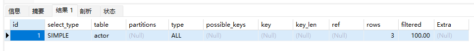

结果可以抽象为一张临时表。

1、id

就是表中每一行的id，对应每一条select语句的序列号。id数量与控制台查询语句的数量保持一致。id列越大优先级越高，id相同则从上往下执行。id为null的最后执行。

2、select_type

select_type表示对应语句是简单查询还是复杂查询。

几个常见的值

>- simple : 简单查询，查询不包含子查询 和 union 
>
> 示例见上图
>
>- primary : 复杂查询语句的最外层的select
>
>- subquery : 包含在select语句中的子查询 不在from中
>
>- derived : 包含在from子句的子查询。查询结果放在一个临时表(派生表)中。
>
> 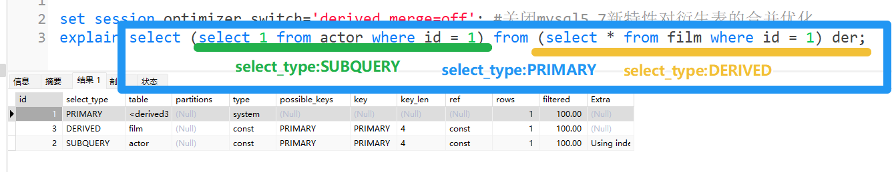
>
>- union: 在语句中union 后面的 select 语句。有多少个union 就有多少个union类型的select_type。
>
>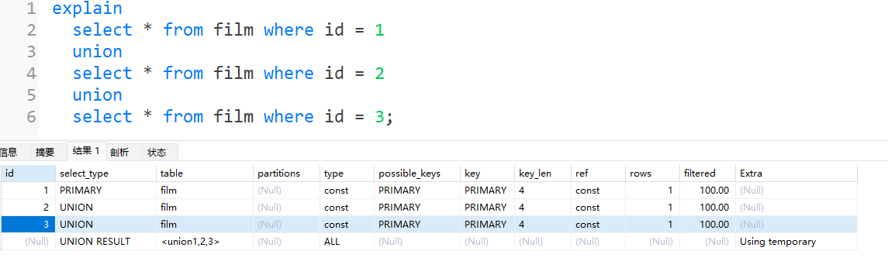
>
>- union_result: 从 union 临时表检索结果的 select

3、table

表示当前的这一行正在访问那个数据库表。当存在from查询子句时，table列为<derivedN>格式。标识当前语句依赖id=N的查询，将会先执行id=N的查询后再执行该语句。

当有union查询时，union_result的table为<union1,2,3,x,...>, 1,2,3,x,... 表示参与union查询的相关select行id。

当值为Null时，表示在执行阶段不需要访问表或者索引。例如，在索引列中选择最小值，只需要访问索引，不需要访问表。

4、partitions

如果查询基于分区表，partitions字段将显示要访问的分区。

5、type

表示**关联类型或访问类型**，通过这一列，可以知道MySQL决定如何查找表中的行。也是优化SQL语句速率的重要值标。

> 最优到最差分别是:`system > const > eq_ref > ref > range > index > ALL`
>
> 一般来说，需要保证查询优化到range级别，最好是ref
>
> - const: 表示MySQL对查询的某一部分进行优化，将其优化到一个常量的形式。
> - system: 是const的特例，表示刚刚好常量等于1。
>
> 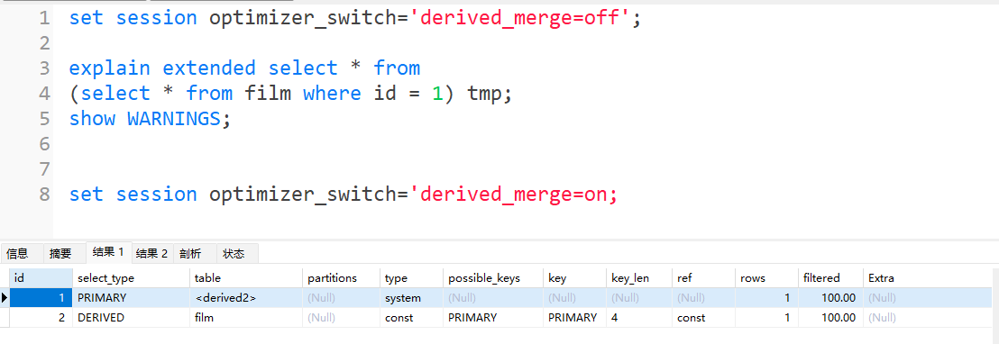
>
> 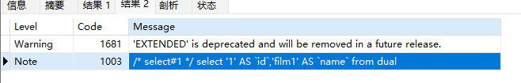
>
> - eq_ref: **主键或者唯一键索引**的所有部分被(连接)使用，最多只会返回一条符合条件的记录。这可能是除了const之外最好的连接类型，简单的select语句不会出现这个type。
>
> 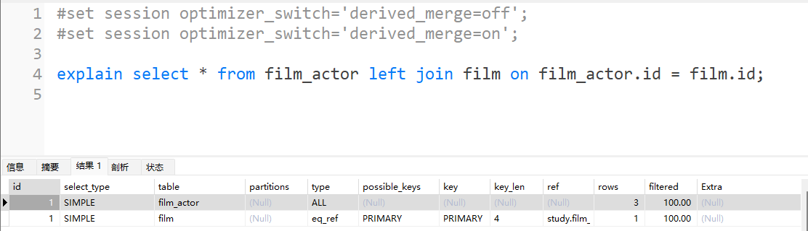
>
> - ref: 对比eq_ref，**不用唯一索引**，而是使用**普通索引**或者**唯一索引的部分前缀**，索引要和某个值比较，可能会有多个符合条件的行。
>
> 1、简单select查询，name是普通索引(不是唯一索引)
>
> 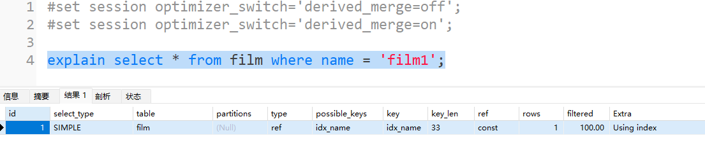
>
> 2、关联表查询，idx_film_actor_id是film_id和actor_id的联合索引，这里使用到了film_actor的左边前缀film_id部分。
>
> 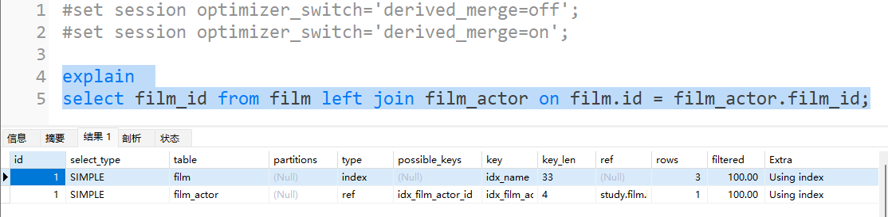
>
> - range: 范围扫描通常出现在范围查询操作中。如`in(), between, >, <, =`等操作中，使用一个索引检索给定范围的值。
>
> 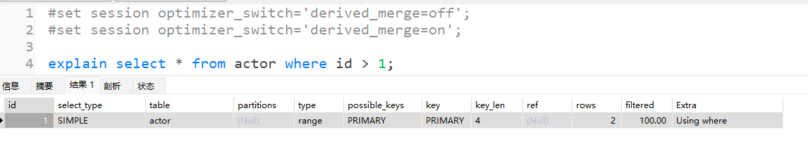
>
> - index: 扫描全索引就能拿到值，一般是扫描某个二级索引，这种扫描直接对二级索引的叶子节点进行扫描，速度还是比较慢的，通常用为覆盖索引。即使比较慢，但还是用到了索引，比全表扫描ALL快一些。
>
> 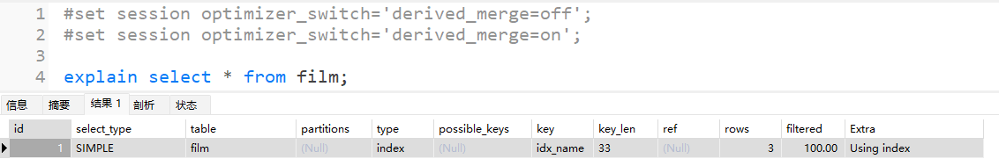
>
> - ALL: 全表扫描，扫描聚簇索引的所有叶子节点。通常这种情况下久需要进行优化了。
>
> 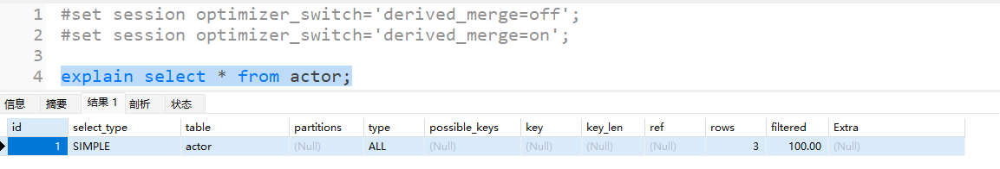

6、possible_keys

这一列显示SQL可能通过哪一个索引进行查找。

如果出现key为Null，但是possible_key不为Null的情况下，说明查询的表数据量可能太小，可以直接使用全表扫描。

如果显示为Null，且没有索引，可以通过where子句创建一个合适的索引。

7、key

显示SQL实际使用哪一个索引进行查找。

如果显示为null，并且需要强制使用possible_key的作为索引，在查询中使用`force index` 、`ignore index`。

8、key_len

显示SQL索引使用的字节数，通过这个值可以推算索引中的列。 

>key_len计算规则
>
>- 字符串 char(n) 和 varchar(n)，5.0.3版本后，**n代表字符数**，如果是UFT-8 一个数字或字幕占**1个字节**，一个汉字占**3个字节**。 【注意区分字节和字符】
>
>  char(n) 如果是汉字 ---- **3n**字节                         
>
>  varchar(n) 如果是汉字 ---- **3n + 2**字节，多的**2**用来存储长度。varchar是可变长字符串。
>
>- 数值类型
>
>  tinyint 1字节 	smallint 2字节	int 4字节	bigint 8字节
>
>- 时间类型
>
>  date 3字节          timestamp 4字节         datetime 8字节
>
>如果字段允许为空，还要额外计算**1字节**
>
>`索引最大长度是 768 字节，当字符串过场时，mysql会做一个类似最左前缀索引处理，`
>`将值前面 部分 的字符提取出来做索引。`

9、ref

表示在key列记录的索引中，查询所使用的列或者常量。 常见为: `const`、字段名[表.列名]，例如`film.id`。

10、rows

mysql预估要读取并且检测的行数。并不是结果集的行数。

>结果集可能由limit 或者 其他条件 如 > 、< 、=等的限制，实际上可能查询语句是全表扫描的。

11、filtered

在查询结果集中显示是 一个百分比的值，`rows x filtered / 100`可以**估算**出将要和explain中前一个表进行连接的行数。 [前一个表指explain 中 的id值币当前表id值小的表]。

12、Extra

表示额外信息。主要由如下几个值。

>- Using index: 使用覆盖索引
>
>如果Mysql 执行计划explain 中的结果列key有使用索引，并且需要查询的字段都可以在这个索引的索引树中获取，这种情况可以说用到了索引覆盖。索引覆盖的extra里一般都有using index。覆盖索引一般针对辅助索引，整个查询的结果通过辅助索引就能获取结果。不需要回表查询主键，通过主键索引树获取其他字段值。
>
>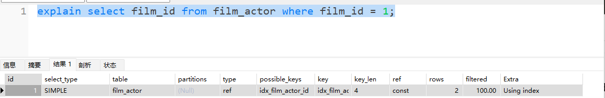
>
>- Using where: 使用where 语句处理结果，并且查询的列没被索引覆盖。
>
>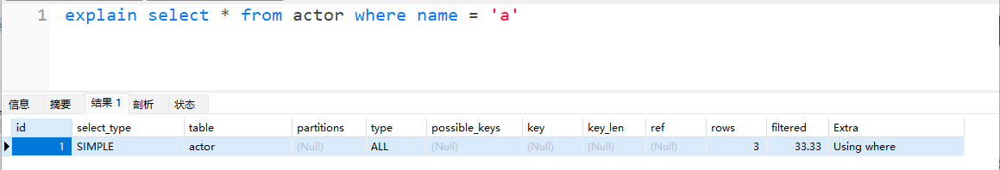
>
>- Using index condition: 查询的列**不完全**被索引覆盖，where条件是一个前导列的范围。
>
>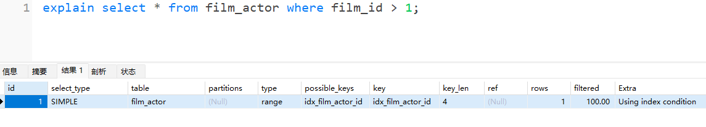
>
>使用联合索引的情况下，不完全使用索引。
>
>- Using temporary: 需要创建一张临时表处理查询。出现这种情况是需要优化的。首先想到的是通过索引优化。
>
>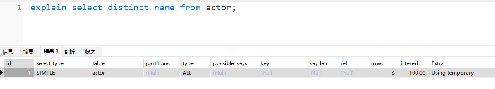
>
>- Using filesort: 使用外部排序而不是索引排序。MySQL在数据较小的时候，使用内存排序，否则通过在磁盘完成排序。这种情况也是考虑使用索引优化解决。
>
>1.actor.name 没有创建索引，会遍历整个actor，保存name和对应的id，在磁盘中排序name并检索行记录。
>
>
>
>2.film.name建立了idx_name索引，此时查询的extra是using index
>
>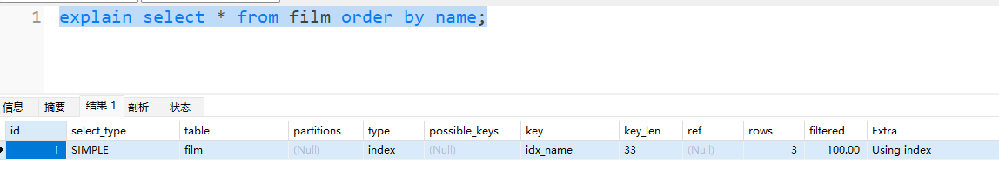
>
>- Select tables optimized away: 使用某些聚合函数(`max 、 min`)来访问存在索引的某个字段。
>
>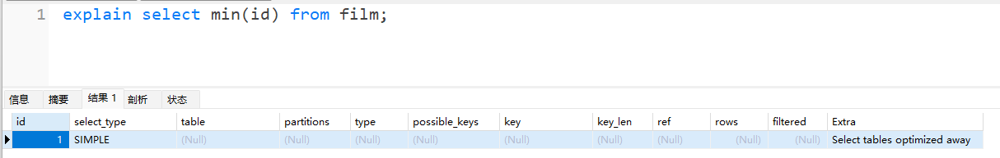

有关详细的Explain解析参考MYSQL官方文档:

[MySQL :: MySQL 5.7 Reference Manual :: 8.8.2 EXPLAIN Output Format](https://dev.mysql.com/doc/refman/5.7/en/explain-output.html)

注意选择对应的MySQL版本号。

### 索引最佳实践

