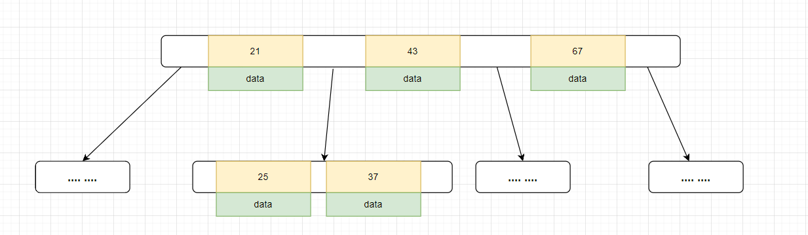

千万级数据表如何用B+树索引快速查找?

使用基于B+树的索引进行查找。

## 索引

索引是一种`数据结构`。

> 索引是帮助MySQL高效获取数据的`排好序`的`数据结构`

### 为什么需要引入索引这种数据结构？

在计算机中，磁盘文件存储是随机存储的，而不是顺序存储。当需要查询某特定数据时，如果是随机存储，那么就得全盘扫描找到这个文件。这花费的时间是巨大的。因此MySQL引入了索引这种数据结构。

---

`MySQL的行为大部分都可以用从索引的角度进行解释。`

索引的数据结构有如下几种：

- 二叉树
- 红黑树
- 哈希表
- B-Tree

上文提到：索引是一种`有序`的数据结构。

MySQL中数据库表中通过主键对数据进行排序。(大概是这个意思)

### 为什么使用B+树作为索引？

>实际上就是为了树的高度尽可能的低，所以选择了B+树作为索引的数据结构。

从数据结构选择出发：

1、二叉树：

当数据按大小顺序插入时，二叉树会形成一条长链。导致树的高度特别大。如果要查询某一个数据，需要从树的根节点遍历整棵树。这与随机存储的全表扫描没有区别。

2、红黑树:

红黑树是一棵二叉平衡树，虽然不会像二叉树一样在顺序插入时形成一条长链。但是在某些情况下树依然很高。当数据量大的情况下，红黑树可能高度特别大。如果需要查询叶子节点的数据，可能有几十层的数据需要比对。

3、B树

为了进一步缩小树的高度。可以将树的每一层节点开辟一个空间，这个空间存储多个数据。只要每个节点开辟的空间能够存储的数据越多，那么树的高度就能尽可能的缩小。这就是B树。但是B树也是KV结构。

•叶节点具有相同的深度，叶节点的指针为空

•所有索引元素不重复

•节点中的数据索引从左到右递增排列

4、B+树

拥有B树的优点

叶子节点拥有所有索引元素，和存储地址。其他节点均为冗余节点。

叶子节点用指针相连，首尾相连。方便范围查找。提高查询性能。

每一个节点代表一个数据页，MySQL数据页大小默认为16KB(`16384`)。查询时先将节点load到内存，通过高效的搜索算法查询节点位置，最后匹配到相关的叶子节点。在内存中查找节点的花费时间可以忽略不计，时间主要耗费在将节点数据页load在内存当中，因此，树的层数越小，花费时间越短。

#### B+树结构可以存储多大的空间呢？

假设使用BigInt作为主键。假设有`3`层存储结构，最底层为叶子节点。

非叶子节点中：一条记录的主键占用空间是8B，相邻的空白部分存储下一个节点的磁盘文件地址，MySQL中大概是6B，那么一个就是14B。16KB一叶能够存储(`16384 / 16 ≈ 1170`). 1170条数据

叶子节点中，data可能存储的是一整行数据，最多是1kb。那么每个叶子节点就有16条数据。

一共 `1170 x 1170 x 16 ≈ 2190w`的数据。

---

Hash 结构

与我们通常认识的HASH哈希表一样。存在哈希冲突问题。同时不方便范围查询。只能查询一些 `=` 或者`in`情况下的内容。有时候能比B+树更高效。

### MySQL数据库表的存储形式

在了解索引是什么之后，下一步了解MySQL数据库表在机器上是如何存储的。

> MySQL存储引擎生效于`数据库表`。每一个数据库表都可以单独设置存储引擎。

MySQL数据库表存储根据不同的索引引擎有着不同的存储形式。MySQL存储引擎目前主要有Innodb、MyISAM两种。

>实际上还有一些别的存储引擎。有关存储引擎的分类请自行查询。

1、在Innodb存储引擎`(后续Innodb皆为Innodb存储引擎)`中

>聚集索引

数据库表在机器上存储是通过两个文件存储的:

.ibd文件和.frm文件。

.frm文件存储表结构，.ibd文件存储数据和索引。对比MyISAM优势在于`数据和索引存储在一起`，不需要将数据文件load到内存中查询。节省时间。在叶子节点中，直接存储当前数据行的所有信息。

.ibd文件实际上存储的就是一颗B+树。

2、在MyISAM存储引擎中

>非聚集索引

数据库表通过三个文件存储:

.frm文件、.MYD文件、.MYI文件。

.frm文件存储表结构。.MYD存储数据。.MYI存储索引。

如果要查询一条数据，首`先查MYI文件`，MYI文件的数据构建成一颗B+树，找到对应叶子节点的数据后
磁盘存储地址，`再查找MYD文件`查找对应的数据。

---

### 聚集索引&聚簇索引&稀疏索引到底是什么?

聚集索引: 在索引的叶子节点中，存储了所有其他列的数据。

非聚集索引：索引和数据分开存储的叫做非聚集索引。

稀疏索引也是一种非聚集索引。

### 为什么DBA总推荐使用自增主键做索引?

Innodb 存储引擎在存储数据库表的时候通过.ibd文件存储。.ibd文件存储的是一颗B+树，而B+树需要默认通过主键进行组织。如果没有主键、那么他会从头开始遍历每一列，找到一个列的每个值是唯一的用于组织B+树。如果不存在这样的列，那么MySQL会创建一个隐藏的列，列的值类似为rowId用于组织B+树。如果创建了主键就不需要MySQL去处理索引。

为什么是自增的呢？
前文提到过：MySQL是一种`排好序`的数据结构。在查找元素时，自增主键比较大小肯定是比UUID这种字符串比较大小要快的。
如果是非自增主键，B+树在每次插入的时候可能会改变树结构。影响查询后续的查询性能。比如说一租节点"1,2,3,4,5,6"中，插入一个"8"再插入一个"7"。

这里degree最大为4。B+树的节点中第一个值是上级节点中的代表。这里如果加入8。变为

看起来没什么影响，但是如果插入再加入7。

可以看到树结构很明显被改变了。8从根节点下降，7插队在8的前面，同时跟节点修改为7。

如果是自增的，就不会出现这种问题。每次都是顺序插入。非自增的情况下，当数据量非常大，索引结构改变后，重构索引时间可能会非常长，影响值加入效率。

### 联合索引底层数据结构是怎样的?

多个字段共同组织成一个索引。一个表中创建2-3个联合索引合适。

联合索引会根据索引的先后顺序进行排序。比如说存在一个`(name,age,position)`联合索引。现根据name进行排序，在name相等的前提下排序age，在name、age都相等的情况下排序position。整个结构看起来是`整体无序，局部有序`的。

### MySQL最左前缀优化原则?

对于(name,age,position)联合索引

联合索引是按照索引的先后进行排序的，当需要使用目标索引position，但是目标索引position之前的索引name、age均没有被使用的时候。联合索引就会失效。同理，当需要使用目标索引age，但是目标索引age之前的索引name没有使用，联合索引也会失效。充分体现了索引的`排序`特点。

比如图中的age,如果需要查询`select * from table where age = 23`
这条SQL进行全表扫描。因为age在索引中不是有序的。

