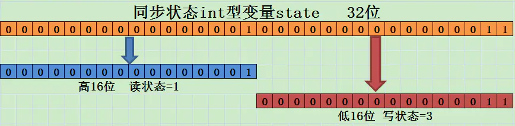
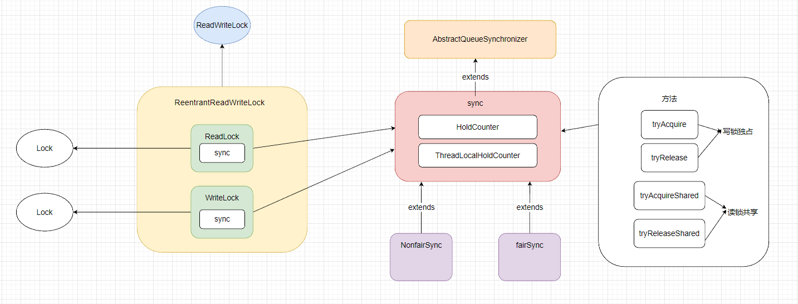

学习了RenntrantLock之后，再来看看ReadWriteLock。

ReentrantLock是显示锁，有时候对于某些场景，比如读写缓存。这类读多写少的场景，如果在并发读写的情况下，除了使用ReentrantLock，有没有更高效的锁呢？

如果使用ReentrantLock，对于每一次线程操作，无论是读的情况还是写的情况，都会加上一把锁。当有大量线程来进行读操作，那么就会存在激烈的锁竞争的情况。此时数据没有修改，锁竞争应该可以避免。当然，如果说有线程读有线程写，那么肯定是需要分别给读写进程都加上锁，这类锁竞争难以避免。如果是写进程和写进程呢？这也是要加锁的。

如果让读进程之间都避免锁竞争，因为在读的时候读的数据都是没有变化的。即让(**读读共享**)，如果存在一个写进程，那么不应该允许其他线程对资源进行读和写操作。即让(**读写互斥，写写互斥**)。

针对这种场景，就需要读写锁实现。


### 读写锁

读写锁是将一把锁分为读和写两部分。读锁允许多个线程一起读，因为读的时候是线程安全的。因此读锁是共享锁。写锁是互斥锁，读和写锁互斥，也就是读写操作不能一起进行。写写操作也不能一起进行。这种设计就符合了读多写少的情况。


#### ReentrantReadWriteLock

JUC中提供了针对读写锁的实现ReentrantReadWriteLock。同ReentrantLock一样，也是基于AQS实现的。只不过他将共享变量进行了拆分，高16位为为读锁部分，低16为为写锁部分。这样就不用实现两个AQS来区分读锁和写锁。

获取读锁的条件

- 没有其他线程的写锁

- 当前线程只有读锁，或者没有获得锁

- **当前存在写请求，并且调用锁和获取锁的线程是同一个**。(这实际上是一个锁降级。后面会解释，**并不是说读写互斥条件不满足**)。

获取写锁的条件

- 没有其他线程的读锁

- 没有其他线程的写锁

> [!note]
>
> 读写锁的三个特性：
>
> 公平/非公平：同ReentrantLock一样，默认非公平锁，性能方法非公平锁优于公平锁。
>
> 可重入：读锁和写锁都支持可重入。读线程在获取读锁后还能再次获取读锁，写线程在获取写锁后也能再获取写锁。
>
> 锁降级：支持写锁降级为读锁，在写线程获取写锁后，未释放之前能够获取读锁，写锁释放后再释放读锁。这样能保证写后马上读到的数据是最新的数据。

适用场景：

读多写少: 适用于读操作多于写操作的场景，允许多个线程同时访问资源，但写操作独占。

缓存: 用于缓存，有效处理大量读操作，保护缓存数据一致性。

#### 锁设计

实现ReadWriteLock接口，该接口中含有两个方法，为读锁和写锁的获取方式，均返回一个Lock对象。

```java
public interface ReadWriteLock {
    /**
     * Returns the lock used for reading.
     *
     * @return the lock used for reading
     */
    Lock readLock();

    /**
     * Returns the lock used for writing.
     *
     * @return the lock used for writing
     */
    Lock writeLock();
}
public interface Lock {
    void lock();
    void lockInterruptibly() throws InterruptedException;
    boolean tryLock();
    boolean tryLock(long time, TimeUnit unit) throws InterruptedException;
    void unlock();
    Condition newCondition();
}
```

实现ReadLock和WriteLock对象，这两个对象实现Lock接口，完成锁方法。

```java
public class ReentrantReadWriteLock
        implements ReadWriteLock, java.io.Serializable {
    private static final long serialVersionUID = -6992448646407690164L;
    /** Inner class providing readlock */
    private final ReentrantReadWriteLock.ReadLock readerLock;
    /** Inner class providing writelock */
    private final ReentrantReadWriteLock.WriteLock writerLock;
    /** Performs all synchronization mechanics */
    final Sync sync;

    /**
     * Creates a new {@code ReentrantReadWriteLock} with
     * default (nonfair) ordering properties.
     */
    public ReentrantReadWriteLock() {
        this(false);
    }

    /**
     * Creates a new {@code ReentrantReadWriteLock} with
     * the given fairness policy.
     *
     * @param fair {@code true} if this lock should use a fair ordering policy
     */
    public ReentrantReadWriteLock(boolean fair) {
        sync = fair ? new FairSync() : new NonfairSync();
        readerLock = new ReadLock(this);
        writerLock = new WriteLock(this);
    }

    public ReentrantReadWriteLock.WriteLock writeLock() { return writerLock; }
    public ReentrantReadWriteLock.ReadLock  readLock()  { return readerLock; }
    // ...
}
```

针对于公平锁和非公平锁实现，同ReentrantLock一样，sync继承AQS，构建NonfairSync和FairSync区分公平和非公平锁。

sync、NonfairSync和FairSync中实现了读锁和写锁中加锁和解锁的基本方法。

针对于读锁，通过共享锁逻辑实现。

```java
public static class ReadLock implements Lock, java.io.Serializable {
    private static final long serialVersionUID = -5992448646407690164L;
    private final Sync sync;

    /**
     * Constructor for use by subclasses
     *
     * @param lock the outer lock object
     * @throws NullPointerException if the lock is null
     */
    protected ReadLock(ReentrantReadWriteLock lock) {
        sync = lock.sync;
    }

    /**
     * Acquires the read lock.
     *
     * <p>Acquires the read lock if the write lock is not held by
     * another thread and returns immediately.
     *
     * <p>If the write lock is held by another thread then
     * the current thread becomes disabled for thread scheduling
     * purposes and lies dormant until the read lock has been acquired.
     */
    public void lock() {
        sync.acquireShared(1);
    }
    // ...

    public boolean tryLock() {
        return sync.tryReadLock();
    }

    /**
     * Attempts to release this lock.
     *
     * <p>If the number of readers is now zero then the lock
     * is made available for write lock attempts.
     */
    public void unlock() {
        sync.releaseShared(1);
    }


}
```

针对于写锁，通过独占锁逻辑实现，本质上与ReentrantLock实现逻辑大体一致。不同的区别处在与AQS的共享变量中高低位的读写锁处理。

```java
protected WriteLock(ReentrantReadWriteLock lock) {
        sync = lock.sync;
    }
    public void lock() {
        sync.acquire(1);
    }

	// ...
    public boolean tryLock( ) {
        return sync.tryWriteLock();
    }

	// ...
    public void unlock() {
        sync.release(1);
    }
}
```

读写锁状态设计：

ReentrantReadWriteLock中使用了一个共享变量来表示读写锁。通过高低位进行区分。

高16位表示读，低16位表示写。



这种按照位进行分割后，读写锁使用位运算进行区分。

假设当前同步状态为S。

- 写状态: 等于 S & 0x0000FFFF(高16位抹去), 当前写状态 + 1，等于S + 1
- 读状态: 等于 S >>> 16 (无符号右移16位)。当前读状态 + 1，等于 S + (1 << 16) 

根据状态划分：S不等于0时，当前写状态等于0，若读状态大于0，则读锁被获取。

```java
/*
 * Read vs write count extraction constants and functions.
 * Lock state is logically divided into two unsigned shorts:
 * The lower one representing the exclusive (writer) lock hold count,
 * and the upper the shared (reader) hold count.
 */

static final int SHARED_SHIFT   = 16;
static final int SHARED_UNIT    = (1 << SHARED_SHIFT);
static final int MAX_COUNT      = (1 << SHARED_SHIFT) - 1;
static final int EXCLUSIVE_MASK = (1 << SHARED_SHIFT) - 1;

/** Returns the number of shared holds represented in count  */
static int sharedCount(int c)    { return c >>> SHARED_SHIFT; }
/** Returns the number of exclusive holds represented in count  */
static int exclusiveCount(int c) { return c & EXCLUSIVE_MASK; }
```

exclusiveCount(int c) 表示获取写锁的次数。

sharedCount(int c) 表示获取读锁的次数。

读读共享中，每个线程都支持可重入，但是这里读锁最多只能记录一个线程的可重入次数，怎么办呢？

可以利用ThreadLocal实现。在ReentrantReadWriteLock中用HoldCounter计数器和ThreadLocalHoldCounter。

---

sync中实现HoldCounter和ThreadLocalHoldCounter。用于读锁的重入计数。

ThreadLocalHoldCounter本质上是一个封装的ThreadLocal。因为读锁在ReentrantReadWriteLock中共用一个AQS，共用一个共享变量。高16位读。低16位写，写锁可以依旧使用+1的方式直接计算可重入次数。

读锁怎么计算呢？利用每个线程都有的ThreadLocal就可以实现。

ThreadLocalHoldCounter是一个ThreadLocal变量，用于存放不是第一个获取线程的其他线程的读锁可重入对象。

HoldCounter用于记录读锁重入数。

```java
/**
 * A counter for per-thread read hold counts.
 * Maintained as a ThreadLocal; cached in cachedHoldCounter
 */
static final class HoldCounter {
    int count = 0;
    // Use id, not reference, to avoid garbage retention
    final long tid = getThreadId(Thread.currentThread());
}

/**
 * ThreadLocal subclass. Easiest to explicitly define for sake
 * of deserialization mechanics.
 */
static final class ThreadLocalHoldCounter
    extends ThreadLocal<HoldCounter> {
    public HoldCounter initialValue() {
        return new HoldCounter();
    }
}
```

因此整个ReadWriteLock的设计可以用如下图表示



#### 如何使用？

读写锁的使用实际上跟ReentrantLock显示锁差不多。读锁和写锁都是需要在finally块释放锁。

```java
private ReadWriteLock readWriteLock = new ReentrantReadWriteLock();
private Lock r = readWriteLock.readLock();
private Lock w = readWriteLock.writeLock();

// 读锁
public Data get(String key) {
    r.lock();
    try {
        // TODO 业务逻辑 
    } finally {
        r.unlock();
    }
}

// 写锁
public void Put(String key, Data value) {
    w.lock();
    try {
        // TODO 业务逻辑
    } finally {
        w.unlock();
    }
}
```

> [!warning]
>
> 读锁不支持条件变量
>
> 不支持重入升级锁：持有读锁的情况去获取写锁，会死锁。
>
> 支持重入降级锁：持有写锁的时候可以获取读锁。

#### 锁降级

锁降级指的是写锁降级为读锁，如果当前一个线程拥有写锁，释放写锁，再获取读锁，释放读锁，这不能称为锁降级。锁降级是指的是持有写锁的同时，能够获取读锁，正常读到写锁修改的数据。然后再释释放写锁，释放读锁。锁降级能够获取当前写线程修改的数据，由于获取了写锁，并且写写互斥，所以其他线程不能修改数据。避免了更新丢失。

锁降级的使用例子

```java
private final ReentrantReadWriteLock rwl = new ReentrantReadWriteLock();
private final Lock r = rwl.readLock();
private final Lock w = rwl.writeLock();
private volatile boolean update = false;

public void processData() {
    r.lock();
    if (!update) {
        // 必须先释放读锁
        r.unlock();
        // 锁降级从读锁获取到开始
        w.lock();
        try {
            if (!update) {
                // TODO 准备数据的流程
                update = true;
            }
            r.lock();
        } finally {
            w.unlock();
        }
        // 锁降级完成，写锁降级为读锁
    }
    try {
        // TODO 使用数据的流程
    } finally {
        r.unlock();
    }
}
```

为什么会有锁降级？

当前线程如果获取获取了写锁，修改了数据，释放了写锁。此时如果要获取读锁，但是在获取前另外一个线程获取了写锁改了数据，那么当前线程读锁获取的数据不是自己修改的数据。出现了更新丢失问题。如果使用锁降级，即线程在释放写锁之前，获取了读锁。即使后面写锁被释放，另一个线程想要获取写锁修改数据也不行，因为读写互斥。避免了更新丢失问题。

不支持锁升级？

如果同时又多个线程进行读操作，一个线程要进行锁升级，将读锁升级为写锁，即使数据被修改，但是同一时间其他线程读取不到这个更新的数据，出现了读不一致问题。

